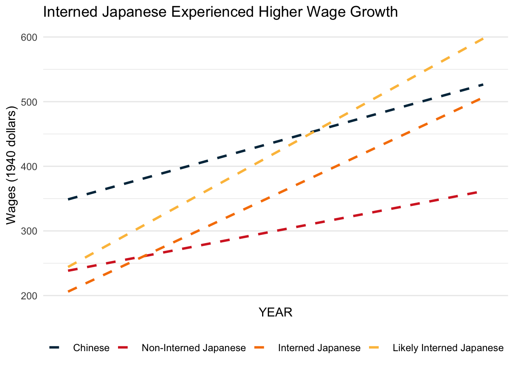

#+title: Japanese Interment and Immigration 
#+author: Dante Yasui

* Internee Outcomes
:PROPERTIES:
:HEADER-ARGS:R: :tangle R/analysis.R :session *R:internment*
:END:

#+begin_src R
library(tidyverse)
df <- read_csv("data/linked_internee_sample.csv") |>
  select(
    id, YEAR, STATEFIP, COUNTYICP, female, race, married, BIRTHYR, age,
    foreign, citizen, generation, homestate,
    employed, wage, lnwage, OCCSCORE, OCC1950, college,
    pr_intern, treat, post, did
    )
#+end_src

#+RESULTS:

#+begin_src R :colnames yes
df |>
  group_by(treat, RACE, YEAR, employed) |>
  summarise(
    n = n(),
    across(c(INCWAGE, OCCSCORE, pr_intern, SEX, BIRTHYR, college, foreign),
           ~round(mean(., na.rm=T), digits = 2)
           )
  )
#+end_src

** Summary Statistics
#+RESULTS:
| treat | RACE | YEAR | employed |    n | INCWAGE | OCCSCORE | pr_intern |  SEX | BIRTHYR | college | foreign |
|-------+------+------+----------+------+---------+----------+-----------+------+---------+---------+---------|
|     0 |    4 | 1940 |        0 | 4060 |   72.76 |     1.42 |         0 | 1.48 | 1920.13 |    0.03 |    0.02 |
|     0 |    4 | 1940 |        1 | 2388 |  559.08 |    25.73 |         0 | 1.08 | 1900.65 |    0.09 |    0.04 |
|     0 |    4 | 1950 |        0 | 3197 |  171.11 |     1.92 |         0 | 1.47 | 1917.71 |    0.04 |    0.08 |
|     0 |    4 | 1950 |        1 | 3243 |  844.78 |    23.77 |         0 | 1.21 | 1908.49 |    0.04 |    0.13 |
|     0 |    5 | 1940 |        0 |  794 |   32.06 |     0.54 |      0.04 | 1.57 | 1919.03 |    0.03 |    0.02 |
|     0 |    5 | 1940 |        1 |  430 |  450.24 |    17.89 |      0.09 |  1.1 | 1895.35 |    0.11 |    0.05 |
|     0 |    5 | 1950 |        0 |  668 |  153.73 |     1.08 |      0.03 | 1.62 | 1915.17 |    0.02 |    0.11 |
|     0 |    5 | 1950 |        1 |  690 |  567.69 |    14.84 |      0.04 | 1.22 | 1909.68 |    0.03 |    0.09 |
|     1 |    5 | 1940 |        0 | 1890 |   18.01 |     0.78 |      0.88 | 1.65 | 1916.36 |    0.03 |    0.02 |
|     1 |    5 | 1940 |        1 | 1517 |  362.46 |    18.09 |      0.88 | 1.25 |  1894.6 |    0.08 |    0.05 |
|     1 |    5 | 1950 |        0 | 1560 |   313.9 |     1.33 |       0.9 | 1.63 | 1907.85 |    0.03 |    0.13 |
|     1 |    5 | 1950 |        1 | 1721 |  765.01 |    15.93 |      0.87 | 1.32 | 1904.41 |    0.04 |    0.13 |
#+begin_src R :colnames yes

#+begin_src R 
library(gtsummary)
df |> filter(YEAR==1940) |>
  tbl_summary(include = c(pr_intern, female, BIRTHYR, employed, college, foreign),
              by = RACE) |>
  as_gt()
#+end_src

#+RESULTS:
| variable  | var_type    | row_type | var_label | label     | stat_1               | stat_2               |
|-----------+-------------+----------+-----------+-----------+----------------------+----------------------|
| pr_intern | continuous  | label    | pr_intern | pr_intern | 0.00 (0.00, 0.00)    | 0.84 (0.40, 1.00)    |
| female    | dichotomous | label    | female    | female    | 2,157 (33%)          | 2,101 (45%)          |
| BIRTHYR   | continuous  | label    | BIRTHYR   | BIRTHYR   | 1,912 (1,899, 1,930) | 1,904 (1,892, 1,927) |
| employed  | dichotomous | label    | employed  | employed  | 2,388 (37%)          | 1,947 (42%)          |
| college   | dichotomous | label    | college   | college   | 340 (5.3%)           | 244 (5.3%)           |
| foreign   | dichotomous | label    | foreign   | foreign   | 181 (2.8%)           | 149 (3.2%)           |

** Diff-in-Diff
*** Wages
#+begin_src R :exports results :results graphics file :file figures/did_plot.png :width 16 :height 12 :res 200 :units cm
df |>
  ggplot(aes(x=YEAR, y = INCWAGE, color = as_factor(group))) +
  geom_line(data = group_averages, aes(x=YEAR, y = INCWAGE, group = group), size=1, linetype = "dashed") +
  scale_color_manual(values=c("#003049", "#D62828", "#F77F00", "#FCBF49")) +
  scale_x_discrete("YEAR") +
  theme_minimal() +
  labs(title="Interned Japanese Experienced Higher Wage Growth",
       x="Year",
       y="Wages (1940 dollars)",
       caption="") +
  theme(legend.title = element_blank(),
        legend.position = "bottom")
#+end_src

#+RESULTS:

#+begin_src R :results output latex :exports results
library(fixest)
reg_did <- feols(INCWAGE ~ did + pr_intern + as_factor(YEAR), data = df, cluster = ~as_factor(COUNTYICP), panel.id = ~id+YEAR)
reg_did_cont <- feols(INCWAGE ~ did + pr_intern + as_factor(YEAR) + female + BIRTHYR + college + married, data = df)
reg_did_state_fe <- feols(INCWAGE ~ did + pr_intern + as_factor(YEAR) | as_factor(STATEFIP), data = df)
reg_did_cont_fe <- feols(INCWAGE ~ did + pr_intern + as_factor(YEAR) + female + BIRTHYR + college + married | as_factor(STATEFIP), data = df)
etable(reg_did, reg_did_cont, reg_did_state_fe, reg_did_cont_fe
       ## , tex = TRUE
       )
#+end_src

#+RESULTS:
#+begin_export latex
NOTE: 11,849 observations removed because of NA values (LHS: 11,849).
NOTE: 11,849 observations removed because of NA values (LHS: 11,849).
NOTE: 11,849 observations removed because of NA values (LHS: 11,849).
NOTE: 11,849 observations removed because of NA values (LHS: 11,849).
                              reg_did       reg_did_cont  reg_did_state_fe   reg_did_cont_fe
Dependent Var.:               INCWAGE            INCWAGE           INCWAGE           INCWAGE
                                                                                            
Constant             335.7*** (19.06) -1,539.9 (1,029.8)                                    
did                  174.5*** (37.68)   192.7*** (28.92)  171.9*** (21.73)  189.7*** (19.98)
pr_intern           -127.4*** (19.08)  -68.17*** (18.01) -156.2*** (5.987) -89.95*** (8.194)
as_factor(YEAR)1950  167.3*** (20.35)   195.4*** (17.95)  167.8*** (14.96)  196.1*** (12.67)
female                                 -347.9*** (13.64)                   -340.8*** (13.89)
BIRTHYR                                 0.9619. (0.5375)                      1.016 (0.7072)
college                                 233.7*** (22.32)                    216.4*** (45.65)
married                                 175.1*** (17.63)                    173.7*** (21.27)
Fixed-Effects:      ----------------- ------------------ ----------------- -----------------
as_factor(STATEFIP)                No                 No               Yes               Yes
___________________ _________________ __________________ _________________ _________________
S.E. type              by: COUNTYICP)                IID     by: STATEFIP)     by: STATEFIP)
Observations                   10,309             10,309            10,309            10,309
R2                            0.02851            0.10424           0.04981           0.12054
Within R2                          --                 --           0.03020           0.10240
---
Signif. codes: 0 '***' 0.001 '**' 0.01 '*' 0.05 '.' 0.1 ' ' 1
#+end_export

*** Other Outcomes
#+begin_src R
wide_df <- df |>
  pivot_wider(id_cols = id, names_from = YEAR, values_from = STATEICP:group) |>
  mutate(lf_drop = case_when(EMPSTAT_1940 == 1 & EMPSTAT_1950 !=1),
         OCCSCORE
#+end_src

#+RESULTS:

#+begin_src R :results output latex :exports results
reg_emp <- feols(employed ~ did + pr_intern + as_factor(YEAR) + female + BIRTHYR + college + married | as_factor(STATEFIP), data = df)
reg_occ <- feols(OCCSCORE ~ did + pr_intern + as_factor(YEAR) + female + BIRTHYR + college + married | as_factor(STATEFIP), data = df)
etable(reg_emp, reg_occ
       ## , tex = TRUE
       )
#+end_src

#+RESULTS:
#+begin_export latex
                                reg_emp            reg_occ
Dependent Var.:                employed           OCCSCORE
                                                          
did                 -0.0491*** (0.0122) -1.514*** (0.4187)
pr_intern            0.0851*** (0.0075) -1.937*** (0.1779)
as_factor(YEAR)1950  0.1343*** (0.0188)  2.257*** (0.5121)
female              -0.3461*** (0.0140) -9.000*** (0.2299)
BIRTHYR             -0.0044*** (0.0010) -0.0871** (0.0259)
college              0.1218*** (0.0099)  8.171*** (0.2978)
married              0.2370*** (0.0251)  7.082*** (0.3222)
Fixed-Effects:      ------------------- ------------------
as_factor(STATEFIP)                 Yes                Yes
___________________ ___________________ __________________
S.E.: Clustered           by: STATEFIP)      by: STATEFIP)
Observations                     22,158             22,158
R2                              0.28343            0.26024
Within R2                       0.27644            0.24787
---
Signif. codes: 0 '***' 0.001 '**' 0.01 '*' 0.05 '.' 0.1 ' ' 1
#+end_export
