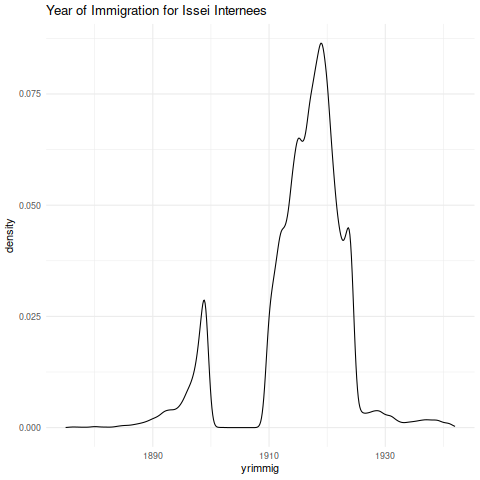

* WRA Camp Internee Records
:PROPERTIES:
:HEADER-ARGS:R: :tangle R/compile_WRA.R :session *R:internment*
:END:
The internee data file is available in the [[https://catalog.archives.gov/][National Archives]] catalog with the NAID =1264228=.
I use the fixed-width file =WRA.FORM26.PU.txt=, of this text file from Jaime Arellano-Bover's online replication package in the [[https://www.openicpsr.org/openicpsr/project/144561/version/V1/view][OpenICPSR repository]].

| Coding | Data |
|--------+------|
| \pi    | -    |
| \alpha | &    |

** Cleaning Functions
Here is a version of Arellano-Bover's original Stata code to process the WRA form 26 data,
rewritten in R.
The file =WRA.FORM26.PU.txt= is read into R as fixed width data using =read_fwf= from the =readr= package.
#+begin_src R :results silent
#------------------------------------------------------------------------------#
#                               README                                         #
# this file was translated from the original stata do file compile_wra.do      #
# from the replication files for "displacement, diversity, and mobility:       #
# careeer impacts of japanese american internment" by jaime arellano-bover     #
# posted here: https://www.jarellanobover.com/research                         #
# translation was helped by the stata to r code translator chatgpt model by    #
# joseph noonan https://chatgpt.com/g/g-ddlktfvbt-stata-to-r-code-translator   #
#------------------------------------------------------------------------------#
#+end_src

The original form included internee's names, the assembly center and WRA camp they were first assigned to,
the county and city of thier previous address before being brought to the assembly centers,
as well as demographic information such as their education attainment, birthplace and year, occupation, and father's characteristics.

Consult the file [[file:./data/NARA-WRA-Form26_documentation.pdf]] to see the documentation page which defines all source variables and thier column positions in the data file.

#+begin_src R :results silent
# variables defined by column ranges in original file
read_fw_form26 <- function(data_file = "data/WRA.FORM26.PU.txt") {
  library(readr)
  # read data by specifying the width in character columns of each source variable
  col_positions <- fwf_widths(
    c(10,             8,                 1,             1,                 1,
      5,              1,                 1,             1,                 1,
      1,              1,                 2,             1,                 1,
      1,              1,                 6,             1,                 1,
      2,              2,                 1,             1,                 1,
      1,              3,                 3,             3,                 3,
      3,              6,                 5),
    col_names <- c(
      "last_name",    "first_name",      "initial",     "camp",            "assembly",
      "prev_address", "brth_cntry_pnts", "fath_occ_us", "fath_occ_abroad", "school_jap",
      "school_jap2",  "high_educ",       "arrival_us",  "length_jap",      "times_jap",
      "age_jap",      "military",        "ind_number",  "sex_marrge",      "race",
      "birth_yr",     "birthplace",      "japsch_ssn",  "educ",            "lang",
      "rel",          "qual_occ_1",      "qual_occ_2",  "qual_occ_3",      "pot_occ_1",
      "pot_occ_2",    "file_no",         "file_no_2")
  )

  fw_data <- read_fwf(
    file = data_file, col_positions,
    # there are weird characters like &,- etc so default to chars
    col_types = cols(.default = col_character())
  )
  return(fw_data)
}
#+end_src

Here is a glimpse at how the original data form looks:
#+begin_src R :tangle no :results silent
library(tidyverse)
library(haven)  # for reading stata data_raw files

# Load dataset
wra_file <- "data/WRA.FORM26.PU.txt"
read_lines(wra_file, n_max = 5)
#+end_src

#+RESULTS:
| KAHASHI TAKEO    401121315&000  172X33001A2714128H5Z309736   041   40388341112  |
| ZUKI    CHIEKO   0071--011&000--000X0H186 6429710P6Z      057   62595759911061  |
| A AS IMA M SAO    5 115241&&41014685X12152A2797969V7Z309631   387   50704272044 |
| AKASA    AKIRA    3B1301346&000--000X23217D1434130L9Z               30396411021 |
| ATO      SHIGEKO J111301515-000  111X03092E642813&Q6Z               10218511072 |

Compare with the version after using the function =read_fw_form26()= defined above:
#+begin_src R :colnames yes :tangle no
read_fw_form26() |> head(n=5) |> select(initial:race)
#+end_src

#+RESULTS:
| initial | camp | assembly | prev_address | brth_cntry_pnts | fath_occ_us | fath_occ_abroad | school_jap | school_jap2 | high_educ | arrival_us | length_jap | times_jap | age_jap | military | ind_number | sex_marrge | race |
|---------+------+----------+--------------+-----------------+-------------+-----------------+------------+-------------+-----------+------------+------------+-----------+---------+----------+------------+------------+------|
|         |    4 |        0 |        11213 |               1 |           5 | &               |          0 |           0 |         0 |            |          1 |         7 |       2 | X        | 33001A     |          2 |    7 |
|         |    0 |        0 |        71--0 |               1 |           1 | &               |          0 |           0 |         0 | --         |          0 |         0 |       0 | X        | 0H186      |          6 |    4 |
|         |    5 |          |        11524 |               1 |           & | &               |          4 |           1 |         0 | 14         |          6 |         8 |       5 | X        | 12152A     |          2 |    7 |
|         |    3 |        B |        13013 |               4 |           6 | &               |          0 |           0 |         0 | --         |          0 |         0 |       0 | X        | 23217D     |          1 |    4 |
| J       |    1 |        1 |        13015 |               1 |           5 | -               |          0 |           0 |         0 |            |          1 |         1 |       1 | X        | 03092E     |          6 |    4 |

There are 137 rows which need to be removed due to mistakenly inserted formatting rows and duplicate records.
#+begin_src R :results silent
form26_drop_dup <- function(fw_data) {
  library(dplyr)
  fw_data |>
    filter(
      ind_number != "", # Drop records with empty ind_number
      ! last_name %in% c("\\\\JOB", "\\\\\\\\")
      ) |> 
    # Handle duplicates
    group_by(ind_number, file_no, first_name, last_name) |>
    mutate(dup_n = row_number(), .after = last_name) |>
    ungroup() |>
    filter(dup_n == 1) |>
    select(-dup_n)
}
#+end_src

** Variables Names and Labels
The original variable codes are pretty cryptic without consulting the documentation,
so I try to recode the important variables and label the new values with =haven= to improve readability of the data file.
I also try to choose values that roughly match the way similar variables are coded in IPUMS
to make the later process of matching easier.

#+begin_src R :results silent
form26_label <- function(raw_data) {
  library(dplyr)
  library(haven)

  geo_dict <- c("00"="United States Unspecified", "11"="Washington", "12"="Oregon", "13"="California",
                "21"="New Mexico", "22"="Colorado", "23"="Idaho", "24"="Montana", "25"="Nevada", "26"="Arizona", "27"="Utah", "28"="Wyoming",
                "31"="Alabama", "32"="Arkansas", "33"="Kentucky", "34"="Louisiana", "36"="Oklahoma", "37"="Tennessee", "38"="Texas",
                "4&"="Wisconsin", "4-"="South Dakota", "40"="Ohio", "41"="Illinois", "42"="Indiana", "43"="Iowa", "44"="Kansas", "45"="Michigan", "46"="Minnesota", "47"="Missouri", "48"="Nebraska", "49"="North Dakota",
                "5&"="West Virginia", "5-"="Virginia", "51"="District of Columbia", "53"="Florida", "54"="Georgia", "55"="Maryland", "56"="New Jersey", "57"="New York", "59"="Pennsylvania",
                "61"="Connecticut", "62"="Maine", "63"="Massachusetts", "64"="New Hampshire", "65"="Rhode Island", "65"="Vermont",
                "70"="Hawaii, Unspecified", "71"="Hawaii County", "72"="Honolulu County", "73"="Kauai County", "74"="Maui County",
                "81"="Alaska", "82"="Canada", "83"="Mexico", "84"="South America",
                "85"="American Samoa", "86"="Guam", "87"="Puerto Rico", "88"="Virgin Islands", "89"="Wake Island",
                "80"="Poland", "8-"="Germany", "8&"="Ireland",
                "90"="Japan, Unspecified", "91"="Sakhalin or Saghalien or Karafuto Is", "92"="Hokkaido or Yezu Is.", "93"="Honshu Northern Division", "94"="Honshu Central Division", "95"="Honshu Central Division", "96"="Honshu Southern Division", "97"="Urban Prefectures (Kyoto, Osaka, and Tokyo)", "98"="Shikoku", "99"="Kyushu", "9-"="Formosa/Taiwan", "9&"="Chosen/Korea",
                "--"="Other")
  
  int_data <- raw_data |> 
    mutate(
      camp = case_when(camp==1 ~ "Manzanar",
                       camp==2 ~ "Poston",
                       camp==3 ~ "Gila River",
                       camp==4 ~ "Tule Lake",
                       camp==5 ~ "Minidoka",
                       camp==6 ~ "Topaz",
                       camp==7 ~ "Heart Mountain",
                       camp==8 ~ "Granada",
                       camp==9 ~ "Rohwer",
                       camp==0 ~ "Jerome"),
      assembly = case_when(assembly==0 ~ "none",
                           assembly==1 ~ "Manzanar",
                           assembly==2 ~ "Fresno",
                           assembly==3 ~ "Marysville",
                           assembly==4 ~ "Mayor",
                           assembly==5 ~ "Merced",
                           assembly==6 ~ "Pinedale",
                           assembly==7 ~ "Pomona",
                           assembly==8 ~ "Portland",
                           assembly==9 ~ "Puyallup",
                           assembly=="-"~ "Sacramento",
                           assembly=="A"~ "Salinas",
                           assembly=="B"~ "Santa Anita",
                           assembly=="C"~ "Stockton",
                           assembly=="D"~ "Tanforan",
                           assembly=="E"~ "Tulare",
                           assembly=="F"~ "Turlock",
                           .default = NA ),
      sex = case_when(sex_marrge %in% c("1", "2", "3", "4", "5", "0") ~ 1, # men
                      sex_marrge %in% c("6", "7", "8", "9", "-", "&") ~ 2, # women
                      .default = NA),
      sex = labelled(as.integer(sex), c("Male" = 1, "Female" = 2)),
      marst = case_when(sex_marrge %in% c("1", "6") ~ 1, # single
                        sex_marrge %in% c("2", "9") ~ 2, # married
                        sex_marrge %in% c("3", "8") ~ 3, # widowed
                        sex_marrge %in% c("4", "9") ~ 4, # divorced
                        sex_marrge == "5" ~ 5, # separated
                        .default = NA),
      marst = labelled(as.integer(marst), c("single" = 1,
                                            "married" = 2,
                                            "widowed" = 3,
                                            "divorced" = 4,
                                            "separated" = 5)),
      birthyr = case_when(as.integer(birth_yr) > 42 ~
                            as.integer(birth_yr) + 1800, # born after 1842
                          as.integer(birth_yr) <= 42 ~ as.integer(birth_yr) + 1900,
                          .default = NA), # born before or during 1942
      race = case_when(race %in% c("4", "7", "L", "O", "V", "5", "J", "M", "P", "W", "6", "K", "N", "Q", "X") ~ 5, # japanese including mixed-race
                       race %in% c("8", "S", "T", "U") ~ 1, # white non-japanese
                       birthplace %in% c("81", "82", "83", "84", "80", "8-", "8&",
                                         "9-", "90", "92", "93", "94", "95", "96", "97", "98",
                                         "99") ~ 5,
                       race %in% c("1", "2") ~ 0), # other race or not specified
      race = labelled(race, c("White" = 1, "Japanese" = 5, "Other/ns" = 0)),
      bpl_pop = case_when(brth_cntry_pnts %in% c("B", "1", "4", "7", "C") ~ 501, # japan
                          brth_cntry_pnts %in% c("K", "2", "5", "8", "L") ~ 99, # US
                          brth_cntry_pnts %in% c("T", "3", "6", "9", "U") ~ 15, # Hawaii
                          .default = NA),
      bpl_pop = labelled(bpl_pop, c("Japan" = 501, "United States" = 99, "Hawaii" = 15)),
      bpl_mom = case_when(brth_cntry_pnts %in% c("A", "1", "2", "3", "D") ~ 501, # japan
                          brth_cntry_pnts %in% c("J", "4", "5", "6", "M") ~ 99, # US
                          brth_cntry_pnts %in% c("S", "7", "8", "9", "V") ~ 15, # Hawaii
                          .default = NA),
      bpl_mom = labelled(bpl_mom, c("Japan" = 501, "United States" = 99, "Hawaii" = 15)),
      yrimmig = suppressWarnings(as.integer(arrival_us)),
      yrimmig = case_when(arrival_us %in% 43:99 ~ yrimmig + 1800, # arrived after 1842
                          arrival_us %in% 00:42 ~ yrimmig + 1900,
                          .default = NA,), # arrived before or during 1942
      birth_country = case_when(
        birthplace %in% c("00", "01", "11", "12", "13", "21", "22", "23",
                          "24", "25", "26", "27", "28", "32", "33", "34",
                          "36", "37", "38", "4&", "4-", "40", "41", "42",
                          "42", "43", "44", "45", "46", "47", "48", "49",
                          "5&", "51", "53", "54", "55", "56", "57", "59",
                          "61", "62", "63", "64", "70", "71", "72", "73",
                          "74", "81", "82", "83", "84") ~ "United States",
        birthplace == "80" ~ "Poland",
        birthplace == "8-" ~ "Germany",
        birthplace == "8&" ~ "Ireland",
        birthplace == "82" ~ "Canada",
        birthplace == "83" ~ "Mexico",
        birthplace == "84" ~ "South America",
        birthplace %in% c("9-", "90", "91", "92", "93", "94", "95", "96",
                          "97", "98", "99") ~ "Japan",
        birthplace == "--" ~ "Other",
        ),
      nativity = case_when(
      (birth_country=="United States" & bpl_pop %in% c(15,99) & bpl_mom %in% c(15,99)) ~ 1,  # both parents native-born
      (birth_country=="United States" & bpl_pop == 501 & bpl_mom %in% c(15,99)) ~ 2,  # foreign father, native mother
      (birth_country=="United States" & bpl_pop %in% c(15,99) & bpl_mom == 501) ~ 3,  # native father, foreign mother
      (birth_country=="United States" & bpl_pop == 501 & bpl_mom == 501) ~ 4,  # both parents foreign-born
      birthplace %in% c("81", "82", "83", "84", "80", "8-", "8&",
                        "9-", "90", "92", "93", "94", "95", "96", "97", "98",
                        "99") ~ 5,       # is foreign born themselves
      .default = NA_real_                    # for any other cases, assign NA
      ),
      nativity = labelled(nativity, c("Native born, native parents"=1,
                                      "Native born, native mother"=2,
                                      "Native born, native father"=3,
                                      "Native born, foreign parents"=4,
                                      "Foreign born"=5)),
      generation = case_when(
      (race==5 & nativity == 5) ~ "Issei",
      (race==5 & nativity %in% 2:4) ~ "Nisei",
      (race==5 & nativity == 1) ~ "Sansei",
      ),
      fath_occ_us = labelled(suppressWarnings(as.integer(fath_occ_us)),
                             c("Professional & semiprofessional"=1,
                               "Managerial and official (exept farm)"=2,
                               "Clerical and sales"=3,
                               "Service"=4,
                               "Farm operators and managers"=5,
                               "Fishermen"=6,
                               "Skilled craftsmen and foremen"=7,
                               "Semi-skilled operators (except farm)"=8,
                               "Unskilled laborers (except farm)"=9
                               )),
      fath_occ_abroad = labelled(suppressWarnings(as.integer(fath_occ_abroad)),
                                 c("Professional & semiprofessional"=1,
                                   "Managerial and official (exept farm)"=2,
                                   "Clerical and sales"=3,
                                   "Service"=4,
                                   "Farm operators and managers"=5,
                                   "Fishermen"=6,
                                   "Skilled craftsmen and foremen"=7,
                                   "Semi-skilled operators (except farm)"=8,
                                   "Unskilled laborers (except farm)"=9
                                   )),
      school_jap = case_when(
        school_jap == "&" ~ NA,
        school_jap == "0" ~ 0,
        school_jap == "1" ~ 1,
        school_jap == "2" ~ 2,
        school_jap == "3" ~ 3,
        school_jap == "4" ~ 4,
        school_jap == "5" ~ 5,
        school_jap == "6" ~ 6,
        school_jap == "7" ~ 7,
        school_jap == "8" ~ 8,
        school_jap == "9" ~ 9,
        school_jap == "A" ~ 10,
        school_jap == "B" ~ 11,
        school_jap == "C" ~ 12,
        school_jap == "D" ~ 13,
        school_jap == "E" ~ 14,
        school_jap == "F" ~ 15,
        school_jap == "G" ~ 16,
        ),
      degfield = case_when(
        high_educ %in% c("A", "J", "1") ~ 00, # "Not specified",
        high_educ %in% c("B", "K") ~ 11, # "Agriculture",
        high_educ %in% c("C", "L") ~ 60, # "Arts",
        high_educ %in% c("D", "M") ~ 36, # "Biological Sciences",
        high_educ %in% c("E", "N") ~ 24, # "Engineering",
        high_educ %in% c("F", "O") ~ 29, # "Home Economics",
        high_educ %in% c("G", "P") ~ 50, # "Physical Sciences",
        high_educ %in% c("H", "Q") ~ 54, # "Public Health, Hygiene, Physical Ed, Nursing, and Pre-Med.",
        high_educ %in% c("I", "R") ~ 37, # "Social Sciences and Mathematics",
        high_educ %in% "2" ~ 2, # "Divinity, Law, or Other Doctorate",
        high_educ %in% "3" ~ 3, # "Teaching, Nursing, or other Certification",
        .default = NA
      ),
      degfield = labelled(degfield,
                          c("Not specified" = 00, "Agriculture" = 11,
                            "Arts" = 60, "Biological Sciences" = 36,
                            "Engineering" = 24, "Home Economics" = 29,
                            "Physical Sciences" = 50, "Public Health, Hygiene, Physical Ed, Nursing, and Pre-Med."=54,
                            "Social Sciences and Mathematics" = 37,
                            "Divinity, Law, or Other Doctorate" = 2,
                            "Teaching, Nursing, org other Certification"=3)),
      high_deg = case_when(
        high_educ %in% c("A", "B", "C", "D", "E", "F", "G", "H", "I") ~ "bachelors", # bachelors degree
        high_educ %in% c("J", "K", "L", "M", "N", "O", "P", "Q", "R") ~ "masters", # masters degree
        high_educ %in% c("1", "2") ~ "doctorate", # phd or other doctorate
        high_educ == "3" ~ "certificate", # certificate, credential, etc
        ),
      educ = case_when( # highest grade completed or grade attending
        educ %in% "J" ~ 0,
        educ %in% c("S", "K") ~ 1,
        educ %in% c("T", "L") ~ 2,
        educ %in% c("U", "M") ~ 3,
        educ %in% c("V", "N") ~ 4,
        educ %in% c("W", "O") ~ 5,
        educ %in% c("X", "P") ~ 6,
        educ %in% c("Y", "Q") ~ 7,
        educ %in% c("Z", "F") ~ 8,
        educ %in% c("A", "G") ~ 9,
        educ %in% c("B", "H") ~ 10,
        educ %in% c("C", "I") ~ 11,
        educ %in% c("D", "I", "E") ~ 12,
        educ %in% c("1", "5") ~ 14,
        educ %in% c("2", "6") ~ 15,
        educ %in% c("3", "7") ~ 16,
        educ %in% c("4", "8") ~ 17,
        educ %in% c("_", "9") ~ 18,
        .default = NA
      ),
      bpl = case_when( # match birthplace codes from IPUMS
        birthplace == 31 ~ 001,  # Alabama
        birthplace == 81 ~ 002,  # Alaska
        birthplace == 26 ~ 004,  # Arizona
        birthplace == 32 ~ 005,  # Arkansas
        birthplace == 13 ~ 006,  # California
        birthplace == 22 ~ 008,  # Colorado
        birthplace == 61 ~ 009,  # Connecticut
        birthplace == 52 ~ 010,  # Delaware
        birthplace == 51 ~ 011,  # District of Columbia
        birthplace == 53 ~ 012,  # Florida
        birthplace == 54 ~ 013,  # Georgia
        birthplace %in% 70:74 ~ 015,  # Hawaii
        birthplace == 23 ~ 016,  # Idaho
        birthplace == 41 ~ 017,  # Illinois
        birthplace == 42 ~ 018,  # Indiana
        birthplace == 43 ~ 019,  # Iowa
        birthplace == 44 ~ 020,  # Kansas
        birthplace == 33 ~ 021,  # Kentucky
        birthplace == 34 ~ 022,  # Louisiana
        birthplace == 62 ~ 023,  # Maine
        birthplace == 55 ~ 024,  # Maryland
        birthplace == 63 ~ 025,  # Massachusetts
        birthplace == 45 ~ 026,  # Michigan
        birthplace == 46 ~ 027,  # Minnesota
        birthplace == 35 ~ 028,  # Mississippi
        birthplace == 47 ~ 029,  # Missouri
        birthplace == 24 ~ 030,  # Montana
        birthplace == 48 ~ 031,  # Nebraska
        birthplace == 25 ~ 032,  # Nevada
        birthplace == 64 ~ 033,  # New Hampshire
        birthplace == 56 ~ 034,  # New Jersey
        birthplace == 21 ~ 035,  # New Mexico
        birthplace == 57 ~ 036,  # New York
        birthplace == 58 ~ 037,  # North Carolin
        birthplace == 49 ~ 038,  # North Dakota
        birthplace == 40 ~ 039,  # Ohio
        birthplace == 36 ~ 040,  # Oklahoma
        birthplace == 12 ~ 041,  # Oregon
        birthplace == 59 ~ 042,  # Pennsylvania
        birthplace == 65 ~ 044,  # Rhode Island
        birthplace == 50 ~ 045,  # South Carolina
        birthplace == "4-" ~ 046,  # South Dakota
        birthplace == 37 ~ 047,  # Tennessee
        birthplace == 38 ~ 048,  # Texas
        birthplace == 27 ~ 049,  # Utah
        birthplace == 66 ~ 050,  # Vermont
        birthplace == "5&" ~ 051,  # Virginia
        birthplace == 11 ~ 053,  # Washington
        birthplace == "5-" ~ 054,  # West Virginia
        birthplace == "4-" ~ 055,  # Wisconsin
        birthplace == 28 ~ 056,  # Wyoming
        birthplace == 0 ~ 099,  # United States, ns
        birthplace %in% 90:99 ~ 501, # Japan
        birthplace == 82 ~ 150,  # Canada
        birthplace == 83 ~ 200, # Mexico
        birthplace == 84 ~ 300, # South America
        .default = NA),
      bpl = labelled(bpl, c("Alabama" = 001, "Alaska" = 002, "Arizona"
                            = 004, "Arkansas" = 005, "California" = 006, "Colorado" = 008,
                            "Connecticut" = 009, "Delaware" = 010, "District of Columbia" =
                                                                     011, "Florida" = 012, "Georgia" = 013, "Hawaii" = 015, "Idaho" =
                                                                                                                              016, "Illinois" = 017, "Indiana" = 018, "Iowa" = 019, "Kansas" =
                                                                                                                                                                                      020, "Kentucky" = 021, "Louisiana" = 022, "Maine" = 023,
                            "Maryland" = 024, "Massachusetts" = 025, "Michigan" = 026,
                            "Minnesota" = 027, "Mississippi" = 028, "Missouri" = 029,
                            "Montana" = 030, "Nebraska" = 031, "Nevada" = 032, "New Hampshire" = 033, "New Jersey" = 034, "New Mexico" = 035, "New York" = 036, "North Carolina" = 037, "North Dakota" = 038, "Ohio"
                            = 039, "Oklahoma" = 040, "Oregon" = 041, "Pennsylvania" = 042,
                            "Rhode Island" = 044, "South Carolina" = 045, "South Dakota" =
                                                                            046, "Tennessee" = 047, "Texas" = 048, "Utah" = 049, "Vermont" =
                                                                                                                                   050, "Virginia" = 051, "Washington" = 053, "West Virginia" =
                                                                                                                                                                                054, "Wisconsin" = 055, "Wyoming" = 056, "United states, ns" =
                                                                                                                                                                                                                           099, "Japan" = 501, "Canada" = 150, "Mexico" = 200, "South America" = 300) ),
      birthplace = recode(birthplace, !!! geo_dict),
      )

  occ_codes <- tribble(
    ~Code,  ~occ1950,  ~Description,
    ## "0-1", 1001, "Artistic work",
    ## "0-2", 1002, "Musical work",
    ## "0-3", 1003, "Literary work",
    ## "0-4", 1004, "Entertainment work",
    ## "0-6", 1006, "Technical work",
    ## "0-8", 1008, "Managerial work",
    ## "1-1", 1011, "Computing work",
    ## "1-2", 1012, "Recording work",
    ## "1-4", 1014, "General Clerical work",
    ## "1-5", 1015, "Public Contact work",
    ## "2-1", 1021, "Cooking",
    ## "2-3", 1023, "Child care",
    ## "2-5", 1025, "Personal Service",
    ## "3-1", 1031, "Farming",
    ## "3-8", 1038, "Fishery work",
    ## "3-9", 1039, "Forestry work",
    ## "4-2", 1042, "Machine trades",
    ## "4-6", 1046, "Crafts",
    ## "6-2", 1062, "Observational work",
    ## "6-4", 1064, "Manipulative work",
    ## "6-6", 1066, "Elemental work",
    001, 000, "Accountants and auditors",
    002, 001, "Actors and actresses",
    003, 003, "Architects",
    004, 004, "Artists, sculptors, and teachers of art",
    006, 006, "Authors, editors, and reporters",
    007, 007, "Chemists, assayers, and metallurgists",
    008, 009, "Clergymen",
    011, 010, "College presidents, professors, and instructors",
    012, 1112, "County agents and farm demonstrators",
    013, 032, "Dentists",
    015, 042, "Engineers, chemical",
    016, 043, "Engineers, civil",
    017, 044, "Engineers, electrical",
    018, 045, "Engineers, industrial",
    019, 046, "Engineers, mechanical",
    020, 048, "Engineers, mining",
    022, 055, "Lawyers and judges",
    023, 056, "Librarians",
    024, 057, "Musicians and teachers of music",
    025, 073, "Pharmacists",
    026, 075, "Physicians and surgeons",
    027, 079, "Social and welfare workers",
    028, 083, "Statisticians",
    030, 1130, "Teachers, primary school and kindergarten",
    031, 1131, "Teachers (secondary school) and principals",
    032, 093, "Teachers and instructors, n.o.c.",
    033, 058, "Trained nurses",
    034, 098, "Veterinarians",
    038, 099, "Professional occupations, n.o.c.",
    041, 1141, "Aviators",
    042, 008,  "Chiropractors",
    043, 514,  "Decorators and window dressers",
    044, 1144, "Commercial artists",
    045, 031,  "Dancers and chorus girls",
    046, 033, "Designers",
    048, 035, "Draftsmen",
    050, 095, "Laboratory technicians and assistants",
    052, 097, "Healers and medical service occupations, n.e.c.",
    053, 071, "Optometrists",
    056, 074, "Photographers",
    057, 005, "Athletes, sports instructors, and sports officials",
    061, 076, "Radio operators",
    062, 1162, "Showmen",
    064, 092, "Surveyors",
    065, 054, "Embalmers and undertakers",
    066, 096, "Technicians, except laboratory",
    068, 1168, "Semiprofessional occupations, n.e.c.",
    071, 1171, "Hotel and restaurant managers",
    072, 290, "Retail managers",
    073, 1173, "Wholesale managers",
    074, 200, "Buyers and department heads, stores",
    075, 205, "Floor men and floor managers, stores",
    079, 210, "Inspectors, managerial and official",
    081, 400, "Advertising agents",
    083, 260, "Officials of lodges, societies, unions, etc.",
    085, 204, "Credit men",
    087, 230, "Managers and superintendents, buildings",
    088, 240, "Ship captains, mates, pilots and engineers",
    091, 280, "Purchasing agents and buyers, n.o.c.",
    092, 203, "Conductors, railroad",
    094, 250, "Public officials, n.o.c.",
    095, 1195, "Inspectors, public service, n.o.c.",
    097, 1197, "Judges, court clerks, and auditors",
    098, 1198, "Managers and officials, n.o.c.",
    101, 310, "Bookkeepers and cashiers, except bank cashiers",
    102, 341, "Bookkeeping machine operators",
    103, 1203, "Clerks",
    104, 1204, "Clerks, general",
    105, 1205, "Clerks, general office",
    106, 1206, "Financial institution clerks, n.o.c.",
    107, 1207, "Hotel clerks, n.o.c.",
    108, 1208, "Insurance clerks, n.o.c.",
    110, 1210, "Printing and publishing clerks, n.o.c.",
    111, 1211, "Railroad clerks, n.o.c.",
    112, 1212, "Clerks in trade, n.o.c.",
    115, 1215, "Collectors, bills and accounts",
    116, 1216, "Correspondence clerks",
    117, 1217, "File clerks",
    118, 1218, "General industry clerks",
    120, 301, "Library assistants and attendants",
    123, 340, "Messengers, errand boys, and office boys and girls",
    124, 360, "Telegraph messengers",
    125, 1225, "Office machine operators",
    126, 1226, "Paymasters, payroll clerks, and timekeepers",
    127, 1227, "Post office clerks",
    128, 335, "Mail carriers",
    131, 325, "Express messengers and railway mail clerks",
    132, 302, "Physicians' and dentists' assistants and attendants",
    133, 350, "Secretaries",
    134, 1234, "Shipping and receiving clerks",
    136, 1236, "Statistical clerks and compilers",
    137, 1237, "Stenographers and typists",
    138, 1238, "Stock clerks",
    141, 365, "Telegraph operators",
    142, 370, "Telephone operators",
    143, 1243, "Baggage, transportation",
    144, 380, "Ticket, station, and express agents, transportation",
    145, 1245, "Weighers",
    148, 1248, "Agents and appraisers, n.o.c.",
    149, 1249, "Clerks and kindred occupations, n.o.c.",
    151, 410, "Auctioneers",
    152, 1252, "Salesmen, brokerage and commission firms, n.e.c.",
    155, 1255, "Canvassers and solicitors",
    156, 420, "Demonstrators",
    157, 450, "Salesmen, insurance",
    158, 460, "Newsboys",
    161, 430, "Hucksters and peddlers",
    163, 470, "Salesmen, real estate",
    165, 480, "Salesmen, stock and bond",
    170, 490, "Sales clerks",
    175, 1275, "Salespersons",
    180, 1280,  "Salesmen, to consumers",
    185, 1285,  "Salesmen, n.o.c.",
    186, 1286,  "Salesmen and sales agents, except to consumers",
    187, 1287,  "Sales clerks, dry cleaning and laundry",
    197, 1297, "Shoppers",
    201, 1301, "Day workers",
    202, 710, "Laundresses, private family",
    203, 1303, "Housewomen, private family",
    204, 1304, "Housesman and yardman",
    205, 1305, "Cooks; domestic",
    206, 1306, "Maids, general",
    207, 1307, "Nursomaids",
    208, 1308, "Parlormaids",
    209, 1309, "Miscellaneous servants, private family",
    221, 750,  "Bartenders",
    222, 1322, "Bellmen and related occupations",
    223, 752, "Boarding-house and lodging-house keepers",
    224, 1324, "Maids and housesman, hotels, restaurants, etc.",
    225, 764, "Housewomen, stewards and hostesses",
    226, 754, "Cooks, except private family",
    227, 784, "Waiters and waitresses, except private family",
    228, 1328, "Ship Stewards",
    229, 1329, "Kitchen workers in hotels, restaurants, railroads, steamships, etc., n.e.c.",
    232, 740, "Barbers, beauticians, and manicurists",
    234, 751, "Bootblacks",
    236, 1336, "Guides, except hunting and trapping",
    238, 772, "Midwives and practical nurses",
    240, 732, "Attendants, recreation and amusement, n.e.c.",
    242, 730, "Attendants, hospitals and other institutions, n.e.c.",
    243, 731, "Attendants, professional and personal service, n.o.c.",
    244, 1344, "Camp attendants",
    245, 1345, "Doormen",
    247, 1347, "Apprentices to service occupations",
    248, 783, "Ushers",
    261, 763, "Guards and watchmen, except crossing watchmen",
    262, 1362, "Crossing watchmen and bridge tenders",
    263, 762, "Firemen, fire department",
    265, 773, "Policemen and doctivos, except in public service",
    266, 782, "Sheriffs and bailiffs",
    268, 1368, "Soldiers, sailors, marines, and coast guards, n.o.c.",
    282, 753, "Charwomen and cleaners",
    284, 770, "Janitors and sextons",
    286, 780, "Porters, n.o.c.",
    291, 1391, "Pullman porters",
    292, 1392, "Baggage porters",
    295, 761, "Elevator operators",
    301, 1401, "Cash grain farmers",
    302, 1402, "Cotton farmers",
    303, 1403, "Crop specialty farmers",
    304, 1404, "Dairy farmers",
    305, 1405, "Fruit farmers",
    306, 100, "General farmers",
    307, 1407, "Animal and livestock farmers",
    308, 1408, "Poultry farmers",
    309, 1409, "Truck farmers",
    311, 1411, "Farm hands, grain",
    312, 1412, "Farm hands, cotton",
    313, 1413, "Farm hands, crop specialty",
    314, 1414, "Farm hands, dairy",
    315, 1415, "Farm hands, fruit",
    316, 1416, "Farm hands, general farms",
    317, 1417, "Farm hands, animal and livestock",
    318, 1418, "Farm hands, poultry",
    319, 1419, "Farm hands, vegetables",
    330, 1430, "Fruit and vegetable graders and packers",
    331, 1431, "Blight control laborers and bindwood eradicators",
    332, 1432, "Irrigation occupations",
    335, 1435, "Farm mechanics",
    336, 1436, "Farm couples",
    337, 123, "Farm managers and foremen",
    338, 1438, "Nursery operators and florist growers",
    339, 1439, "Nursery and landscaping laborers",
    340, 930, "Gardeners and groundskeepers, cemeteries, etc.",
    341, 1441, "Hatchery men",
    342, 1442, "Laborers, hatchery",
    343, 1443, "Stablemen",
    344, 1444, "Barn bosses",
    347, 1447, "Cotton ginnors",
    348, 1448, "Technical agricultural occupations, n.o.c.",
    349, 1449, "Agricultural occupations, n.o.c.",
    387, 910, "Fishermen and oystermen",
    388, 1488, "Sponge and seaweed gatherers",
    389, 1489, "Fishing (occupations), n.o.c.",
    391, 1491, "Forestry occupations, n.o.c., logging",
    396, 1492, "Hunting and trapping, n.o.c.",
    397, 1497, "Hunters and trappers",
    401, 500, "Bakers",
    402, 1502, "Occupations in production of bakery products, n.o.c.",
    602, 1602, "(semiskilled) Occupations in production of bakery products, n.o.c.",
    802, 1702, "(unskilled) Occupations in production of bakery products, n.o.c.",
    403, 1503, "Occupations in production of beverages",
    603, 1603, "(semiskilled) Occupations in production of beverages",
    803, 1703, "(unskilled) Occupations in production of beverages",
    404, 1504, "Occupations in canning and preserving of food",
    604, 1604, "(semiskilled) Occupations in canning and preserving of food",
    804, 1704, "(unskilled) Occupations in canning and preserving of food",
    405, 1505, "Occupations in production of confections",
    605, 1605, "(semiskilled) Occupations in production of confections",
    805, 1705, "(unskilled) Occupations in production of confections",
    406, 1506, "Occupations in processing of dairy products",
    606, 1606, "(semiskilled) Occupations in processing of dairy products",
    806, 1706, "(unskilled) Occupations in processing of dairy products",
    407, 1507, "Millers, grain, flour, food, etc.",
    607, 1607, "(semiskilled) Millers, grain, flour, food, etc.",
    408, 1508, "Occupations in production of grain-mill products, n.o.c.",
    608, 1608, "(semiskilled) Occupations in production of grain-mill products, n.o.c.",
    808, 1708, "(unskilled) Occupations in production of grain-mill products, n.o.c.",
    409, 1509, "Occupations in slaughtering and in preparation of meat products",
    609, 1609, "(semiskilled) Occupations in slaughtering and in preparation of meat products",
    809, 1809, "(unskilled) Occupations in slaughtering and in preparation of meat products",
    410, 1510, "Occupations in production of miscellaneous food products",
    610, 1610, "(semiskilled) Occupations in production of miscellaneous food products",
    810, 1710, "(unskilled) Occupations in production of miscellaneous food products",
    412, 1512, "Occupations in manufacture of tobacco products",
    612, 1612, "(semiskilled) Occupations in manufacture of tobacco products",
    812, 1712, "(unskilled) Occupations in manufacture of tobacco products",
    415, 684, "Weavers, textile",
    416, 543, "Loom fixers",
    618, 1618, "(semiskilled) Nonprocess occupations, in manufacture of textiles, n.o.c.",
    818, 1718, "(unskilled) Nonprocess occupations, in manufacture of textiles, n.o.c.",
    419, 1519, "Occupations in manufacture of textiles, n.o.c.",
    619, 1619, "(semiskilled) Occupations in manufacture of textiles, n.o.c.",
    819, 1719, "(unskilled) Occupations in manufacture of textiles, n.o.c.",
    423, 625,  "Milliners",
    425, 633,  "Dressmakers and seamstresses",
    625, 1625, "(semiskilled) Dressmakers and seamstresses",
    426, 590,  "Tailors and tailoresses",
    427, 1527, "Occupations in fabrication of textile products, n.o.c.",
    627, 1627, "(semiskilled) Occupations in fabrication of textile products, n.o.c.",
    827, 1727, "(unskilled) Occupations in fabrication of textile products, n.o.c.",
    429, 532,  "Inspectors, scalers, and graders, log and lumber",
    629, 1632,  "(semikilled) Inspectors, scalers, and graders, log and lumber",
    430, 950,  "Lumbermen, raftsmen, and woodchoppers",
    630, 1630,  "(semiskilled) Lumbermen, raftsmen, and woodchoppers",
    830, 1730,  "(unskilled) Lumbermen, raftsmen, and woodchoppers",
    431, 1531,  "Sawmill occupations, n.o.c.",
    631, 1631,  "(semiskilled) Sawmill occupations, n.o.c.",
    831, 1731,  "(unskilled) Sawmill occupations, n.o.c.",
    439, 1539,  "Occupations in manufacture of miscellaneous finished lumber products, n.o.c.",
    639, 1639,  "(semiskilled) Occupations in manufacture of miscellaneous finished lumber products, n.o.c.",
    839, 1739,  "(unskilled) Occupations in manufacture of miscellaneous finished lumber products, n.o.c.",
    432, 505,  "Cabinetmakers",
    444, 512, "Compositors and typesetters",
    644, 1644, "(semiskilled) Compositors and typesetters",
    445, 520, "Electrotypers and stereographers",
    447, 571, "Phtoengravers",
    448, 575, "Pressmen and plate printers, printing",
    449, 1529, "Occupations in printing and publishing, n.o.c.",
    649, 1629, "(semiskilled) Occupations in printing and publishing, n.o.c.",
    452, 1552, "Occupations in production of paint and varnish",
    459, 1559, "Occupations in manufacture of leather",
    659, 1659, "(semiskilled) Occupations in manufacture of leather",
    460, 582, "Shoemakers and shoe repairmen, not factory",
    471, 534, "Jewelers, watchmakers, goldsmiths, and silversmiths",
    475, 544, "Machinists",
    476, 592, "Toolmakers and die sinkers and setters",
    480, 591, "Tinsmiths, coppersmiths, and sheet metal workers",
    481, 561, "Molders",
    483, 503, "Boilermakers",
    485, 685, "Welders and flame cutters",
    486, 501, "Blacksmiths, forgemen, and hammermen",
    491, 641, "Furnacemen, smeltermen, and pourers",
    497, 515, "Electricians",
    508, 563, "Opticians, lens grinders, and polishers",
    509, 1709, "Occupations in manufacture of fabricated plastic products",
    512, 572, "Piano and organ tuners",
    516, 670, "Painters, except construction and maintenence",
    517, 570, "Pattern and model makers, except paper",
    518, 634, "Dyers",
    521, 650, "Miners, and mining-machine operators",
    525, 510, "Carpenters",
    526, 511, "Cement and concrete finishers",
    527, 564, "Painters, construction and maintenance",
    528, 565, "Paperhangers",
    530, 574, "Plumbers, gas fitters, and storm fitters",
    735, 632, "Routemen",
    536, 1536, "Chauffers and drivers, bus, taxi; truck; and tractor",
    736, 682, "(semiskilled) Chauffers and drivers, bus, taxi; truck; and tractor",
    537, 960, "Teamsters",
    541, 541, "Locomotive engineers",
    542, 542, "Locomotive firemen",
    543, 661, "Motormen, street, subway, and elevated railway",
    555, 562, "Motion picture projectionists",
    557, 643, "Ocupations in laundering, cleaning, dying, and processing apparel and other articles",
    558, 1558, "Meatcutters, except in slaughtering and packing houses",
    760, 621, "Attendants, filling stations and parking lots",
    572, 583, "Engineers, stationary",
    580, 545, "Mechanics and repairmen, airplane",
    581, 550, "Mechanics and repairmen, motor vehicle",
    583, 554, "Mechanics and repairmen, n.o.c.",
    785, 920, "Garage laborers and car washers and greasers",
    586, 671, "Photographic process occupations",
    591, 1691, "Foremen, manufacturing",
    594, 1694, "Foremen, construction",
    595, 1695, "Foremen, transportation, communication, and utilities",
    597, 1697, "Foremen, services, amusements",
    599, 1699, "Foremen, n.o.c.",
    )

  # Vector for recoding (named vector: names = old codes, values = new codes)
  recode_vec <- setNames(occ_codes$occ1950, occ_codes$Code)
  
  # Vector for value labels (names = descriptions, values = new numeric codes)
  label_vec <- setNames(occ_codes$occ1950, occ_codes$Description)

  occ_vars <- names(int_data)[str_detect(names(int_data), "^(qual|pot)_occ_")]

  lbl_data <- int_data |>
    mutate(qual_occ_1 = suppressWarnings(as.integer(qual_occ_1))) |> 
    mutate(across(all_of(occ_vars), ~ recode(.x, !!!recode_vec))) |>       # Recode character codes to new numeric
    mutate(across(all_of(occ_vars), ~ labelled(as.integer(.x), labels = label_vec)))  # Apply labels

  return(lbl_data)
}
#+end_src 

** Previous Address Counties of Internees
--------------------------------------------------------------------------------
*NOTE*: This is now outdated.
I went ahead and just combined all the relevant codes for the WRA previous
addresses into one file =WRA_prev_address.csv=.
--------------------------------------------------------------------------------

I started the process of going through the =NARA-WRA-Form26_documentation.pdf=
to look up the count and city codes manually, but it's pretty annoying.
I have all of the states and counties coded so far, as well as all of the identifiable cities in states except for California and Oregon.
Identifing cities has been a lot of me doing detective work of which cities fall into a population category where I can narrow it down to a single one.
There might be a better way to do it, but I'm leaving the city work for the future.

#+begin_src R :results silent :tangle no
# previous address codes transcribed from WRA form 26 documentation
wra_counties <- read_csv("data/WRA_prev_address.csv") |>
  select(-city) |>
  distinct(state, county)
#+end_src

For the list of state and county names in the WIP previous address list,
I want to give them appropriate NHGIS codes to make the joins with other datasets easier.
The county names from the WRA records should match the county names from the NHGIS system for counties in 1940.
#+begin_src R :colnames yes :tangle no
nhgis_shp <- "data/nhgis0035_shape.zip"
nhgis_codes <- read_ipums_sf(nhgis_shp, file_select = matches("us_county_1950")) |>
    sf::st_drop_geometry() |>
    mutate(STATENAM = case_when(
           STATENAM == "Alaska Territory" ~ "Alaska",
           STATENAM == "Hawaii Territory" ~ "Hawaii",
           .default = STATENAM
           )) |>
    select(STATENAM, NHGISNAM ,NHGISST, NHGISCTY)

full_join(wra_counties, nhgis_codes,
                             by = c("state" = "STATENAM", "county" = "NHGISNAM") ) |>
  tail()
#+end_src

#+RESULTS:
| state        | county  | NHGISST | NHGISCTY |
|--------------+---------+---------+----------|
| Virginia     | York    |     510 |     1990 |
| Texas        | Young   |     480 |     5030 |
| Colorado     | Yuma    |      80 |     1250 |
| Texas        | Zapata  |     480 |     5050 |
| Texas        | Zavala  |     480 |     5070 |
| South Dakota | Ziebach |     460 |     1370 |

Overall, the counties match up pretty well.

Here is a function which strips the names and NHGIS codes from a shapefile downloaded via =define_extract_nhgis= in the IPUMSR API.

#+begin_src R :results silent :tangle no
get_nhgis_codes <- function(shp) {
  library(dplyr)
  library(ipumsr)

  nhgis_codes <- read_ipums_sf(shp, file_select = matches("us_county_1950")) |>
    sf::st_drop_geometry() |>
    mutate(STATENAM = case_when(
           STATENAM == "Alaska Territory" ~ "Alaska",
           STATENAM == "Hawaii Territory" ~ "Hawaii",
           .default = STATENAM
           )) |>
    select(STATENAM, NHGISNAM ,NHGISST, NHGISCTY)
  return(nhgis_codes)
}
#+end_src

I'm going to save these wra counties with nhgis codes to a separate file than the original for now, in case I go back later to change the original.
#+begin_src R :results silent :tangle no
wra_counties <- function(nhgis, addr) {
  library(tidyverse)
  # read nhgiscodes from shapefile
  nhgis_codes <- read_csv(nhgis)
  wra_counties <- read_csv(addr)
  join_counties <- inner_join(wra_counties, nhgis_codes,
                              by = c("state" = "STATENAM", "county" = "NHGISNAM") )
  return(join_counties)
}
#+end_src

#+RESULTS:

** Individual Internees Data Cleaned
This function takes the raw form 26 text file and the list of previous address codes and returns a tibble with the cleaned data with the variables on names, previous addresses, camp, assembly center, demographics (which are coded to be joined to IPUMS census variables), and the occupations of each internee.
#+begin_src R
compile_WRA <- function(wra_file="data/WRA.FORM26.PU.txt",
                        adr_file = "data/WRA_prev_address.csv") {
  library(dplyr)
  # read, clean and label pipeline for wra microdata
  data_labelled <- read_fw_form26(wra_file) |>
    form26_drop_dup() |>
    form26_label()

  # geography codes to join to prev_addr codes
  addr <- read_csv(adr_file)

  data_int <- data_labelled |>
    left_join(addr, by = "prev_address") |>
    select(ind_number, state, county, city, NHGISST, NHGISCTY,
           camp, assembly, race, sex, birthyr, bpl, birthplace,
           bpl_pop, bpl_mom, yrimmig, nativity, generation,
           degfield, high_deg, educ, 
           fath_occ_us, fath_occ_abroad, school_jap,
           last_name, first_name)
}
#+end_src

#+RESULTS:

#+RESULTS:

#+begin_src R :tangle no
data <- compile_WRA(wra_file="data/WRA.FORM26.PU.txt", adr_file="data/WRA_prev_address.csv")
write_dta(data, "data/all_internees.dta")
#+end_src

#+RESULTS:

Version without labels to save as csv.
#+begin_src R :tangle no
csv_data <- as_factor(data)
write_csv(csv_data, "data/all_internees.csv") 
#+end_src

#+RESULTS:

** Internee Demographic Groups
The function =count_internees= takes in a tibble of internee data (=all_internees=),
and a list of variables to use to create summary groups.
By default it will count all internees in the record in each county,
but other demographic variables like =birthyr=, =birthplace=, =sex=, etc can be added to split the internees into more specific subgroups.
This is meant to help the process of iterating different specifications of the internment prediction on subgroups of Japanese Americans who appear in other datasets.
#+begin_src R 
count_internees <- function(data,
                            vars=c("state", "county")) {
  library(tidyverse)
  groups <- data |>
    filter(!is.na(state)) |>
    count(across(all_of(vars))) |>
    mutate(p = n / sum(n))
  return(groups)
}
#+end_src

#+RESULTS:

* WRA Internee Statistics
:PROPERTIES:
:HEADER-ARGS:R: :session *R:internment*
:END:
Summarise the internee records file.
#+begin_src R :results silent
library(modelsummary)
library(tidyverse)
library(haven)
#+end_src

#+begin_src R
ddi <- "data/fullcount_census/usa_00126.xml"

# callback function to calculate county summary stats
jpstat_cb <- function(x, pos) {
  x |>
    filter(RACE==5, YEAR==1940) |>
    mutate(across(c("SEX", "EDUC", "EDUCD", "OCC1950"), as_factor),
           BIRTHYR = ifelse(BIRTHYR %in% 9996:9999 , NA, BIRTHYR)
           )
}

jp_demo <- read_ipums_micro_chunked(
  ddi,
  vars = c("YEAR", "RACE", "SEX", "BIRTHYR", "BPL", "EDUC", "EDUCD", "OCC1950"),
  callback = IpumsDataFrameCallback$new(jpstat_cb),
  chunk_size = 1e5,
  verbose = TRUE
) |>
  bind_rows()
#+end_src

#+RESULTS:

#+begin_src R
cen_demo <- jp_demo |>
  mutate(educ = case_when(
           EDUCD == "Missing" ~ NA,
           EDUCD == "No schooling completed" ~ 0,
           EDUCD == "Kindergarten" ~ 0,
           EDUCD == "Grade 1" ~ 1,
           EDUCD == "Grade 2" ~ 2,
           EDUCD == "Grade 3" ~ 3,
           EDUCD == "Grade 4" ~ 4,
           EDUCD == "Grade 5" ~ 5,
           EDUCD == "Grade 6" ~ 6,
           EDUCD == "Grade 7" ~ 7,
           EDUCD == "Grade 8" ~ 8,
           EDUCD == "Grade 9" ~ 9,
           EDUCD == "Grade 10" ~ 10,
           EDUCD == "Grade 11" ~ 11,
           EDUCD == "Grade 12" ~ 12,
           EDUCD == "1 year of college" ~ 13,
           EDUCD == "2 years of college" ~ 14,
           EDUCD == "3 years of college" ~ 15,
           EDUCD == "4 years of college" ~ 16,
           EDUCD == "5 years of college" ~ 17,
           EDUCD == "6 years of college" ~ 18,
           EDUCD == "7 years of college" ~ 19,
           EDUCD == "8+ years of college" ~ 20,
           ),
         brth_country = case_when(BPL %in% 1:99 ~ "United States",
                                  BPL == 501 ~ "Japan",
                                  BPL == 150 ~ "Canada",
                                  BPL == 200 ~ "Mexico",
                                  BPL == 300 ~ "South America"),
         source = "1940 Census",
         ) |>
  rename(birthyr="BIRTHYR", sex="SEX") |>
  select(sex, birthyr, educ, brth_country, source)

#+end_src

#+RESULTS:

#+begin_src R
int_demo <- read_dta(file="data/all_internees.dta") |>
  mutate(
    across(c("camp", "assembly", "race", "sex", "degfield", "fath_occ_us"), as_factor),
    brth_country = case_when(bpl %in% 1:99 ~ "United States",
                             bpl == 501 ~ "Japan",
                             bpl == 150 ~ "Canada",
                             bpl == 200 ~ "Mexico",
                             bpl == 300 ~ "South America"),
    source = "Internees",
  ) |>
  select(sex, birthyr, educ, brth_country, source)

tbl_dt <- bind_rows(cen_demo, int_demo)

datasummary_balance(~source, data = tbl_dt,
                    output = "tables/balance_stats.tex"
                    )
#+end_src

#+RESULTS:

#+begin_src R
datasummary_balance(~brth_country, data = int_demo)
#+end_src

#+RESULTS:

** County of Origin to WRA Camp

#+begin_src R :colnames yes
county_data <- compile_WRA(file="data/WRA.FORM26.PU.txt", addr_file="data/WRA_counties.csv") |>
  filter(!is.na(state)) |>
  count(state, county) |>
  mutate(camp = "Total")

camp_data <- read_dta(file="data/all_internees.dta") |>
  mutate(camp = as_factor(camp)) |>
  filter(!is.na(camp)) |>
  count(state, county, camp)

camp_data |> 
  bind_rows(county_data) |>
  pivot_wider(names_from = camp, values_from = n) |>
  arrange(desc(Total)) |>
  head(n=20)
#+end_src

#+RESULTS:
| state      | county        | Jerome | Manzanar | Poston | Gila River | Tule Lake | Minidoka | Topaz | Heart Mountain | Granada | Rohwer | Total |
|------------+---------------+--------+----------+--------+------------+-----------+----------+-------+----------------+---------+--------+-------|
| California | Los Angeles   |   3049 |     8879 |   2780 |       4851 |       360 |       28 |    62 |           6342 |    2837 |   4331 | 33520 |
| Washington | King          |        |        1 |      8 |         20 |      2679 |     5852 |     8 |             18 |       6 |      6 |  8598 |
| California | Sacramento    |    965 |      376 |    664 |        401 |      4841 |       10 |    19 |              6 |     487 |     58 |  7827 |
| California | Fresno        |   1942 |       25 |   1591 |       1936 |        37 |        8 |    20 |              1 |      23 |     37 |  5620 |
| California | San Joaquin   |      4 |      160 |     18 |        779 |       356 |       31 |    22 |              3 |      27 |   3511 |  4912 |
| California | San Francisco |     59 |       81 |     63 |        174 |       225 |        6 |  3359 |            671 |      74 |     80 |  4792 |
| California | Alameda       |     60 |       20 |     95 |        328 |       300 |       16 |  3635 |            111 |      77 |     51 |  4694 |
| California | Santa Clara   |     57 |       16 |    467 |        207 |       219 |          |   134 |           2502 |      50 |     16 |  3669 |
| Oregon     | Multnomah     |        |        1 |      1 |            |       308 |     1864 |     1 |             66 |       1 |        |  2242 |
| California | Tulare        |    199 |        4 |   1947 |         25 |         5 |        6 |     9 |              1 |       2 |      4 |  2202 |
| California | San Diego     |     25 |       38 |   1877 |         17 |         2 |        4 |     1 |             19 |      11 |      3 |  1997 |
| Washington | Pierce        |        |        3 |        |            |       938 |      999 |       |              4 |         |      2 |  1946 |
| California | Santa Barbara |     38 |       16 |     44 |       1767 |        16 |        1 |     7 |             23 |       6 |     20 |  1938 |
| California | Orange        |     28 |       78 |   1611 |         57 |        10 |          |     3 |             17 |      10 |     41 |  1855 |
| California | Monterey      |     44 |        8 |   1490 |         73 |       125 |        3 |    25 |              7 |      37 |     10 |  1822 |
| California | Placer        |      3 |          |     10 |            |      1746 |        3 |     1 |              1 |       2 |      1 |  1767 |
| California | Imperial      |        |        7 |   1486 |         16 |         2 |          |     2 |             11 |         |      6 |  1530 |
| California | Santa Cruz    |     23 |          |   1203 |         46 |        88 |        1 |     1 |             16 |      13 |      7 |  1398 |
| California | Kern          |    332 |       13 |    821 |         16 |         9 |       10 |    10 |              2 |      13 |     15 |  1241 |
| California | Yolo          |      1 |        1 |     10 |        120 |       348 |          |       |                |     626 |        |  1106 |

** Demographic Groups
#+begin_src R :colnames yes
read_dta(file="data/all_internees.dta") |>
  filter(state!="", county!="", race ==5) |>
  mutate(cohort = case_when(
           birthyr %in% 1929:1942 ~ "0-13",
           birthyr %in% 1923:1928 ~ "14-19",
           birthyr %in% 1913:1922 ~ "20-29",
           birthyr %in% 1903:1912 ~ "30-39",
           birthyr %in% 1893:1902 ~ "40-59",
           birthyr %in% 1883:1892 ~ "50-59",
           birthyr < 1883 ~ "60+",
         ) ) |>
  count(state, county, as_factor(sex), cohort) |>
  arrange(desc(n)) |>
  head(n=100)
#+end_src

#+RESULTS:
| state      | county        | as_factor(sex) | cohort |    n |
|------------+---------------+----------------+--------+------|
| California | Los Angeles   | female         |  20-29 | 4010 |
| California | Los Angeles   | male           |  20-29 | 3822 |
| California | Los Angeles   | male           |   0-13 | 3444 |
| California | Los Angeles   | female         |   0-13 | 3326 |
| California | Los Angeles   | male           |  14-19 | 2497 |
| California | Los Angeles   | male           |  50-59 | 2384 |
| California | Los Angeles   | female         |  14-19 | 2373 |
| California | Los Angeles   | female         |  40-59 | 2233 |
| California | Los Angeles   | male           |  30-39 | 1994 |
| California | Los Angeles   | male           |  40-59 | 1887 |
| California | Los Angeles   | male           |    60+ | 1803 |
| California | Los Angeles   | female         |  30-39 | 1656 |
| California | Los Angeles   | female         |  50-59 | 1212 |
| Washington | King          | female         |  20-29 | 1040 |
| Washington | King          | male           |  20-29 | 1005 |
| California | Sacramento    | male           |  20-29 |  903 |
| California | Sacramento    | male           |   0-13 |  889 |
| California | Sacramento    | female         |  20-29 |  825 |
| California | Sacramento    | female         |   0-13 |  800 |
| Washington | King          | male           |  50-59 |  780 |
| California | Fresno        | female         |  20-29 |  742 |
| Washington | King          | female         |   0-13 |  741 |
| Washington | King          | male           |   0-13 |  734 |
| Washington | King          | female         |  40-59 |  727 |
| Washington | King          | male           |  14-19 |  724 |
| Washington | King          | female         |  14-19 |  697 |
| California | Fresno        | male           |  20-29 |  671 |
| California | Sacramento    | female         |  14-19 |  666 |
| California | Sacramento    | male           |  14-19 |  660 |
| California | San Joaquin   | male           |  20-29 |  627 |
| California | Alameda       | female         |  20-29 |  605 |
| California | Sacramento    | male           |    60+ |  601 |
| California | San Francisco | female         |  20-29 |  592 |
| California | Alameda       | male           |  20-29 |  583 |
| California | San Francisco | male           |  20-29 |  577 |
| Washington | King          | male           |    60+ |  546 |
| California | San Joaquin   | male           |    60+ |  538 |
| California | Fresno        | male           |   0-13 |  534 |
| California | Fresno        | female         |   0-13 |  508 |
| California | Sacramento    | male           |  50-59 |  502 |
| California | Fresno        | male           |    60+ |  497 |
| California | San Joaquin   | male           |   0-13 |  495 |
| California | San Joaquin   | female         |   0-13 |  492 |
| California | Fresno        | male           |  14-19 |  488 |
| California | Alameda       | male           |   0-13 |  484 |
| California | Fresno        | female         |  14-19 |  476 |
| California | San Joaquin   | female         |  20-29 |  474 |
| California | Sacramento    | female         |  40-59 |  469 |
| California | Santa Clara   | female         |  20-29 |  459 |
| California | San Joaquin   | male           |  50-59 |  458 |
| California | Santa Clara   | female         |   0-13 |  456 |
| California | Alameda       | female         |   0-13 |  449 |
| California | San Francisco | male           |  50-59 |  435 |
| California | Santa Clara   | male           |  20-29 |  435 |
| California | Los Angeles   | female         |    60+ |  430 |
| Washington | King          | female         |  50-59 |  420 |
| California | Fresno        | male           |  50-59 |  390 |
| California | San Francisco | female         |  40-59 |  389 |
| California | Fresno        | female         |  40-59 |  387 |
| California | Santa Clara   | male           |   0-13 |  377 |
| California | San Francisco | male           |   0-13 |  375 |
| California | San Francisco | male           |    60+ |  374 |
| California | San Joaquin   | male           |  14-19 |  373 |
| California | Sacramento    | male           |  40-59 |  365 |
| California | San Joaquin   | female         |  14-19 |  359 |
| California | Sacramento    | male           |  30-39 |  356 |
| Washington | King          | male           |  30-39 |  355 |
| California | San Francisco | female         |   0-13 |  343 |
| California | Alameda       | female         |  14-19 |  338 |
| Washington | King          | male           |  40-59 |  336 |
| California | Santa Clara   | female         |  14-19 |  327 |
| California | Sacramento    | female         |  30-39 |  320 |
| California | Sacramento    | female         |  50-59 |  319 |
| California | San Francisco | male           |  30-39 |  305 |
| California | Santa Clara   | male           |  14-19 |  304 |
| California | Alameda       | male           |  50-59 |  303 |
| California | Alameda       | male           |  14-19 |  301 |
| California | Alameda       | male           |    60+ |  298 |
| Oregon     | Multnomah     | female         |  20-29 |  294 |
| Washington | King          | female         |  30-39 |  294 |
| California | San Francisco | male           |  40-59 |  280 |
| California | Alameda       | female         |  40-59 |  277 |
| California | San Francisco | female         |  14-19 |  271 |
| California | San Francisco | male           |  14-19 |  270 |
| Washington | Pierce        | male           |  20-29 |  265 |
| California | San Joaquin   | female         |  40-59 |  260 |
| California | Santa Clara   | male           |    60+ |  260 |
| California | Tulare        | male           |   0-13 |  258 |
| California | Santa Barbara | male           |  20-29 |  256 |
| Washington | Pierce        | female         |  20-29 |  255 |
| California | Alameda       | male           |  30-39 |  249 |
| Oregon     | Multnomah     | male           |  20-29 |  248 |
| California | Alameda       | female         |  30-39 |  246 |
| California | Monterey      | female         |   0-13 |  245 |
| California | Tulare        | male           |  20-29 |  243 |
| California | Placer        | male           |  20-29 |  240 |
| California | San Francisco | female         |  30-39 |  238 |
| California | Monterey      | male           |   0-13 |  236 |
| California | Orange        | male           |  20-29 |  236 |
| California | San Diego     | male           |  20-29 |  231 |

** Age Distribution
#+begin_src R :exports results :results graphics file :file figures/internee-age_plot.pdf
library(paletteer)
library(haven)
read_dta(file="data/all_internees.dta") |>
  filter(!is.na(camp)) |>
  mutate(age = 1942 -birthyr) |>
  ggplot(aes(x=age, group = as_factor(camp), fill = as_factor(camp))) +
  geom_histogram() +
  ## geom_density(alpha = 0.5) +
  theme_minimal() +
  theme(
    ## legend.title = element_blank(),
    legend.position = "bottom"
  ) +
  labs(
    title = "Internee Age Distribution by Camp",
    x = "Age",
    fill = "WRA Camp",
    ) +
  scale_fill_paletteer_d("MetBrewer::Hiroshige")
#+end_src

#+RESULTS:
[[file:figures/internee-age_plot.pdf]]

** Year of arrival in US
#+begin_src R :exports results :results graphics file :file figures/internee-yrimmig_plot.png
library(paletteer)
library(haven)
read_dta(file="data/all_internees.dta") |>
  filter(!is.na(yrimmig)) |>
  ggplot(aes(x=yrimmig)) +
  xlim(1875,1942) +
  geom_density() +
  theme_minimal() +
  theme(
    ## legend.title = element_blank(),
    legend.position = "bottom"
  ) +
  labs(
    title = "Year of Immigration for Issei Internees",
    ) +
  scale_fill_paletteer_d("MetBrewer::Hiroshige")
#+end_src

#+RESULTS:

** Hood River Yasui Family
#+begin_src R :colnames yes
read_csv("data/all_internees.csv") |>
  filter(str_detect(last_name, "YASUI"), county=="Hood River") |>
  select(first_name, last_name, birthyr, sex, birthplace, yrimmig, educ, degfield, fath_occ_us) |>
  arrange(birthyr)
#+end_src

#+RESULTS:
| first_name | last_name | birthyr | sex    | birthplace               | yrimmig | educ | degfield       | fath_occ_us                          |
|------------+-----------+---------+--------+--------------------------+---------+------+----------------+--------------------------------------|
| SHIDZUYO   | YASUI     |    1886 | Female | Honshu Southern Division |    1912 |   17 | Home Economics |                                      |
| RAY        | YASUI     |    1915 | Male   | Oregon                   |         |   15 |                | Managerial and official (exept farm) |
| MINORU     | YASUI     |    1916 | Male   | Oregon                   |         |   18 |                | Farm operators and managers          |
| MIKIE      | YASUI     |    1917 | Female | Oregon                   |         |   17 | Arts           | Farm operators and managers          |
| HOMER      | YASUI     |    1924 | Male   | Oregon                   |         |   11 |                | Managerial and official (exept farm) |
| YUKA       | YASUI     |    1927 | Female | Oregon                   |         |    8 |                | Managerial and official (exept farm) |
