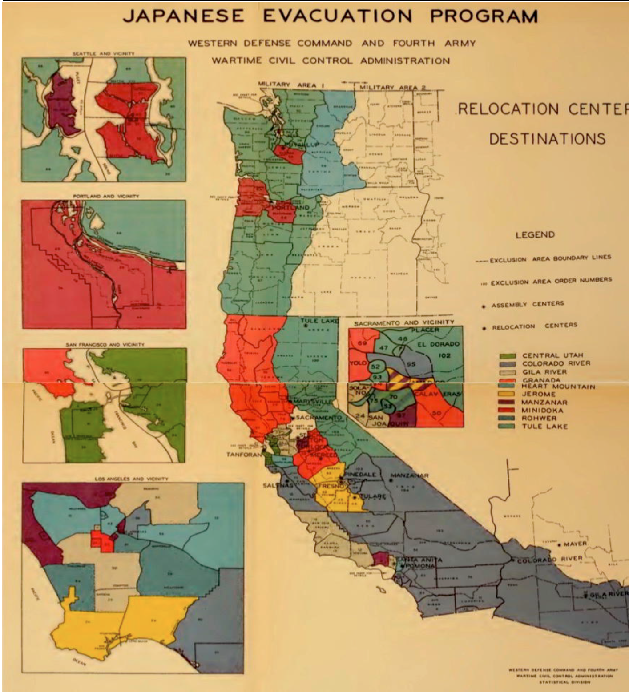
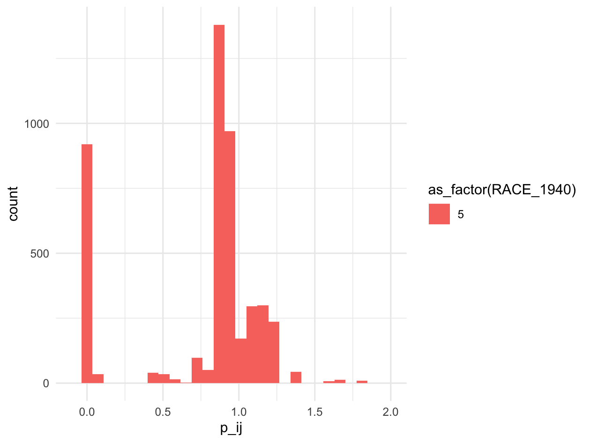

#+toc: 2
#+bibliography: main.bib

#+begin_src mermaid :file data-plan.svg :tangle no
flowchart TD
%% Data sources
    nara@{ shape: hex, label: "🌐 National Archives"};
    ipums@{ shape: hex, label: "🌐 IPUMS"};
    nhgis@{ shape: hex, label: "🌐 NHGIS"};
    jarvis@{ shape: hex, label: "🌐 JARVIS"};

%% raw data files 
    ipumsdat@{ shape: card, label: "💾 usa_00123.dat.gz"};
    fullct@{ shape: card, label: "💾 usa_00126.dat.gz"};
    shp@{ shape: card, label: "💾 US_county_1940.shp"};
    wra@{ shape: card, label: "💾 WRA.FORM26.PU.txt"};

%% intermediate data files
    duckdb@{ shape: cyl, label: "💽 ipums_db.duckdb"};
    panel@{ shape: card, label: "💾 mlp_panel.csv"};
    wage@{ shape: card, label: "💾 mlp_wage_panel.csv"};
    internees@{ shape: card, label: "💾 all_internees.csv"};
    counties@{ shape: card, label: "💾 county_stats.csv"};
    icounties@{ shape: card, label: "💾 internee_counties.csv"};

%% functions
    pr_int@{ shape: subproc, label: "⇥ predict_internment()"};

%% main analysis datasets
    m1@{ shape: card, label: "💾 dt_wages.csv"};
    m2@{ shape: card, label: "💾 dt_all.csv"};
    c1@{ shape: card, label: "💾 dt_county.csv"};

%% create edges
    ipums -- download --> ipumsdat & fullct;
    fullct -- summarize --> counties;
    ipumsdat --📄 write-db.R--> duckdb -- "mlp linking" --> panel;
    panel -- "filter have wage" --> wage;
    nhgis --> shp --> counties;
    nara --> wra --📄 compile-wra.R--> internees --> pr_int --> panel --> m2;
    internees --> icounties --> c1;
    wage --> m1;
    counties --> m1 & m2;
    counties --> c1;
#+end_src

#+RESULTS:

* Helper Functions and Definitions
** as_nhgis_code
This function takes 
#+begin_src R
as_nhgisst <- function(STATEFIP) {
  NHGISST = str_pad(string = STATEFIP*10, width = 3, side = "left", pad = "0")
}

as_nhgisct <- function(COUNTYICP) {
  NHGISCTY = str_pad(COUNTYICP, width = 4, side = "left", pad = "0")
}

as_ct <- function(STATEFIP, COUNTYICP) {
  nhgisst <- 
}
#+end_sr

** IPUMS Census Variables Definitions
[fn::defintions quoted from IPUMS online documentation: https://usa.ipums.org/usa-action/variables/group]
**** Geographic:
#+begin_src R :results silent
geo_vars <- c("STATEFIP", "STATEICP", "COUNTYICP", "ENUMDIST", "CITY", "URBAN")
#+end_src
***** =STATEFIP=:
  "STATE/FIP/ reports the state in which the household was located, using the
  Federal Information Processing Standards (FIPS) coding scheme, which orders
  the states alphabetically" [fn:countyfip]
***** =STATEICP=:
  "STATE/ICP/ identifies the state in which the housing unit was located, using
  the coding scheme developed by the Inter-University Consortium for Political
  and Social Research (ICPSR). The ICPSR scheme orders states first by
  geographic division and then alphabetically within each division"
***** =COUNTYICP=: 
  "In most cases, the first 3 digits match the FIPS county codes commonly used
  in other datasets. ICPSR adds a digit to accommodate change over time.
  (Generally, if a county merged with another or was renamed before 1970, it
  receives a fourth digit of "5".)"
- For example: Alabama is the first state alphabetically so it gets the FIPS
  code 01. But in ICPSR, its state code is 41. Autauga is the first county
  alphabetically in Alabama, so it gets the =COUNTYICP= code =0010=. 
- For an example of a COUNTYICP code that ends in 5 instead of 0 there are a few
  historical counties of the Kansas Territory which were merged back into
  unorganized territory when Kansas was admitted as a state in 1861. So the
  historical county of Arapahoe, Kansas, shows up as =COUYNTYICP= code =0055=.
**** Demographic:
#+begin_src R :results silent
dem_vars <-c("SEX", "BIRTHYR", "AGE", "MARST", "CHBORN")
#+end_src
***** =SEX=: 
Indicator equal to =1= if male, =2= if female respondent.
***** =BIRTHYR=:
Self reported year of birth for 1900 and 1910 censuses.
In all other years, birth year is imputed based on age and survey year.
See [[https://usa.ipums.org/usa****action/variables/BIRTHYR#comparability_section]]
for notes on using this variable with caution.
***** =AGE=: 
Respondents years of age as of their last birthday.
***** =MARST=:
| =1= | Married, spouse present |
| =2= | Married, spouse absent  |
| =3= | Separated               |
| =4= | Divorced                |
| =5= | Widowed                 |
| =6= | Never married, single   |
***** =CHBORN=:
- "reports the number of children ever born to each woman"
- "Women were to report all live births by all fathers, whether or not the
  children were still living; they were to exclude stillbirths, adopted
  children, and stepchildren."
- =00= is N/A, so to get number of children present, subtract 1 from =CHBORN=
- =99=: Missin

**** Family Interrelationship
#+begin_src R :results silent
fam_vars <-c("MOMLOC", "POPLOC", "SPLOC", "NCHILD", "NSIBS", "NFAMS")
#+end_src
**** Race and Nativity:
#+begin_src R :results silent
nat_vars <- c("RACE", "BPL", "MBPL", "FBPL", "NATIVITY", "CITIZEN")
#+end_src
***** =RACE=: Racial Category
"Prior to 1960, the census enumerator was responsible for categorizing persons
and was not specifically instructed to ask the individual his or her race."
***** =NATIVITY=: National Origin and Parents' Nativity
"NATIVITY indicates whether respondents were native - born or foreign - born; for
native-born respondents, it indicates whether their mothers and/or fathers
were native-born or foreign-born. NATIVITY is constructed from the IPUMS
variables BPL, MBPL, and FBPL. Those U.S. possessions and territories
classified as "U.S. outlying areas" in BPL are considered foreign."
- =BPL=
- =FBPL=
- =MBPL= 
***** =CITIZEN=: Citizenship status
| Label                                | Code |
|--------------------------------------+------|
| N/A (born to american parents in US) |    0 |
| Born abroad of American parents      |    1 |
| Naturalized citizen                  |    2 |
| Not a citizen                        |    3 |
| Not a citizen, received first papers |    4 |
| Foreign born, status not reported    |    5 |

**** Education and Literacy:
#+begin_src R :results silent
edu_vars <- c("EDUC", "SCHOOL")
#+end_src
- =SCHOOL=: School Attendence
  "indicates whether the respondent attended school during a specified period"
  Equal to =1= if not in school, =2= if yes to in school.
- =EDUC=: Educational Attainment
  "indicates respondents' educational attainment, as measured by the highest
  year of school or degree completed"
  Categorical variable with different values for no schooling, middle school,
  how many years of high school or college.
**** Labor Market and Economic
#+begin_src R :results silent
emp_vars <- c("EMPSTAT", "LABFORCE", "CLASSWKR",
                 "OCC", "OCC1950",
                 "WKSWORK1", "HRSWORK1", "DURUNEMP")
#+end_src
***** =EMPSTAT=: Employment Status
Universe includes all persons 14 years or older.
"EMPSTAT indicates whether the respondent was a part of the labor force -- working or seeking work -- and, if so, whether the person was currently unemployed."
***** =LABFORCE=: Labor Force Status
- _Universe_: persons age 14+
- "a dichotomous variable indicating whether a person participated in the labor force"
- "From 1850 to 1930, participation is defined as reporting any gainful
  occupation, as recorded in OCC/OCC1950 (except for institutional inmates, as
  explained below). Due to universe differences during the time period from 1850
  through 1930, the number of those reporting gainful occupations through
  OCC/OCC1950 and those reporting participation in the labor force as documented
  in LABFORCE do not correspond."
***** =CLASSWKR=: Self-employment Status
- _Universe_: Persons age 14+ in the labor force

| Code | Label           |
|------+-----------------|
|    0 | N/A             |
|    1 | Self-employed   |
|    2 | Works for wages |
|    9 | Unknown         |

Detailed codes with cases:
| Code | Label                                                    |  1950 full |  1940 full |
|------+----------------------------------------------------------+------------+------------|
|   00 | N/A                                                      | 90,638,885 | 77,092,753 |
|   10 | Self-employed                                            | 11,679,540 |          0 |
|   11 | Employer                                                 |          0 |  1,039,322 |
|   12 | Working on own account                                   |          0 |  9,492,954 |
|   13 | Self-employed, not incorporated                          |          0 |          0 |
|   14 | Self-employed, incorporated                              |          0 |          0 |
|   20 | Works for wages or salary                                |          0 |      1,602 |
|   21 | Works on salary (1920)                                   |          0 |          0 |
|   22 | Wage/salary, private                                     | 41,486,899 | 34,247,949 |
|   23 | Wage/salary at non-profit                                |          0 |          0 |
|   24 | Wage/salary, government                                  |  5,638,265 |  6,528,767 |
|   25 | Federal government employee                              |          0 |          0 |
|   26 | Armed forces                                             |          0 |          0 |
|   27 | State government employee (in Puerto Rico, Commonwealth) |          0 |          0 |
|   28 | Local government employee                                |          0 |          0 |
|   29 | Unpaid family worker                                     |  2,422,654 |  3,350,093 |
|   98 | Illegible                                                |          0 |    148,958 |
|   99 | Unknown                                                  |    420,834 |          0 |
***** =OCC1950=:
- "OCC1950 applies the 1950 Census Bureau occupational classification system to
  occupational data, to enhance comparability across years"
- "In 1850-1880, any laborer with no specified industry in a household with a
  farmer is recoded into farm labor. In 1860-1900, any woman with an
  occupational response of "housekeeper" enters the non-occupational category
  "keeping house" if she is related to the head of household. Cases affected by
  these imputation procedures are identified by an appropriate data quality
  flag. "
***** =IND1950=:
- "recodes information about industry into the 1950 Census Bureau industrial
  classification system and thus enhances comparability of industry data across
  all years included in the IPUMS. IND1950 was designed the same way as OCC1950
  (Occupation, 1950 basis)"
**** Income and SES
***** =INCWAGE=: Wages and Salary Income
"total pre-tax wage and salary income - that is, money received as an employee - for the previous year"
- _Universe_:
  1940: Persons age 14+, not institutional inmates.
  1950: Sample-line persons age 14+; all persons age 14+ in Alaska.
- Reported in contemporary dollars, should adjust for inflation to compare across years
- _Top Codes:_
  1940: $5,001
  1950: $10,000 
- For 1950 full-count census v1:
#+begin_quote
"Values for personal income are often erroneous (INCTOT, INCWAGE, INCBUSFM, INCOTHER). Multiple values were written in the allotted space on the census forms, which sometimes confused the data capture process. Values might be expressed in single dollars or hundreds, sometimes producing orders-of-magnitude errors which we tried to correct via targeted truncation. /We estimate the current total and wage income values exactly match the intent of the form roughly 70-75% of the time./ The magnitude of the differences ranges widely. Wages are underestimated twice as frequently as they are overestimated. Researchers should be cautious when using these variables and should screen for outliers. We hope to perform supplemental data capture for these fields in the future."
#+end_quote
***** =OCCSCORE=: 
- "The occupational income score indicates the median total income -- in
  hundreds of dollars -- for persons in each occupation in 1950 with positive
  income. It is calculated using data from a published 1950 census repor"
- "OCCSCORE assigns each occupation in all years a value representing the median
  total income (in hundreds of 1950 dollars) of all persons with that particular
  occupation in 1950. OCCSCORE thus provides a continuous measure of
  occupations, according to the economic returns received by people working at
  them in 1950. "
- based on OCC1950
- "Although OCCSCORE is derived from individual-level data, it is not the same
  as actual personal income. The income scores are simply a tool for
  economically scaling occupations - essentially a way of turning occupation
  into a continuous measure."
[fn:countyfip: County-level FIPS codes are only used in the IPUMS data for years 1950-]
***** =UOCC=: *1940 only*
- "reports the sample-line person's "usual" occupation. The instructions to
  enumerators defined the person's usual occupation as "that occupation at
  which he has worked longest during the past ten years and at which he is
  still physically able to work." Used in conjunction with OCC, which indicates
  the respondent's current occupation, UOCC allows users to identify persons
  currently working at an occupation different from their usual one."
**** Other Variables
***** Migration (1940 only)
=MIGRATE5=: Migration status, 5 years
=MIGPLAC5=: US state (or territory, country) of residence 5 years ago
=MIGCOUNTYICP5=: ICPSR code for county of residence 5 years ago
  
** Evacuation Zone Counties
When the Army's Western Defense Command drew up plans to evacuate the West Coast Japanese,
they targeted population based on the existing Japanese populations in the 1940 census.

The WDC's final exclusion area included the western halves of Washington and Oregon, the southern half of Arizona, and all of California.

#+caption: Evacuation Area Map From General DeWitt's Final Report (1942)
#+name: fig:WDC-evac-area

 
* County GIS Files
** Historical Counties
:PROPERTIES:
:header-args:R: :session *R:downloads* :tangle R/download-nhgis.R
:END:

I download shapefiles for county boundaries in 1940 and 1950 from the [[https://www.nhgis.org/][National Historical Geographic Information System]] (NHGIS).

#+begin_src R :results silent
library(ipumsr)
library(tidyverse)
library(sf)
#+end_src

#+begin_src R :eval no
nhgis_extract <- define_extract_nhgis(
  description = "1950 historical county shapefiles",
  shapefiles = "us_county_1950_tl2008" ) |>
  submit_extract()
#+end_src

#+RESULTS:

#+begin_src R :eval no
if (is_extract_ready(nhgis_extract)) {
  download_extract(nhgis_extract, download_dir = "data"
  }
#+end_src

#+begin_src R
nhgis_shp <- "data/nhgis0035_shape.zip"
nhgis_codes <- read_ipums_sf(nhgis_shp, bind_multiple = T) |>
  st_drop_geometry() |>
  select(DECADE:STATENAM) |>
  pivot_wider(
    id_cols = c("STATENAM", "NHGISNAM"),
    names_from = DECADE,
    values_from = c("NHGISST", "NHGISCTY")
  )
#+end_src

#+RESULTS:

#+begin_src R

#+end_src

* Full Count Census
** IPUMS API Download
:PROPERTIES:
:header-args:R: :session *R:ipums* :tangle R/download-ipums.R :colnames yes :export no
:END:
#+name: load-packages
#+begin_src R :results silent
library(ipumsr)
library(tidyverse)
ipums_samples <- c("us1940b", "us1950b")
#+end_src

I download linked full-count census microdata from the IPUMS [[https://usa.ipums.org/usa/mlp/mlp.shtml][Multigenerational Longitudinal Panel]] for the census years 1940 and 1950.

*** General Population
#+begin_src R extract-fullcount :results silent
fcount_vars <- list(
  geo_vars,
  dem_vars,
  nat_vars,
  edu_vars,
  emp_vars,
  "INCWAGE", "OCCSCORE",
  "MIGRATE5", "MIGPLAC5", "MIGCOUNTYICP5"
) |>
  unlist() |>
  as.list()
# download data using IPUMS API
fullcount_extract <- define_extract_micro(
  collection = "usa",
  description = "Full count census data for 1940 and 1950",
  samples = ipums_samples,
  variables = fcount_vars
)
#+end_src

#+begin_src R download-fullcount 
submit_extract(fullcount_extract)
#+end_src

#+begin_example
Unsubmitted IPUMS USA extract 
Description: Full count census data for 1940 and 1950

Samples: (2 total) us1940b, us1950b
Variables: (32 total) STATEFIP, STATEICP, COUNTYICP, ENUMD...
> Successfully submitted IPUMS USA extract number 126
#+end_example

#+begin_src R :results silent
# get extract number of most recent submitted extract
usa_extract_submitted <- get_last_extract_info("usa")
# download to disk if extract is ready
if (is_extract_ready(usa_extract_submitted)) {
  download_extract("data/fullcount_census")
  } else {
    print("Still waiting, check back later")
  }
#+end_src

*** Immigrant Groups
For the group of Japanese and Chinese Americans who make up the treatment and control panel for the main regressions,
I download each respondant's county of residence at the time of being surveyed, as well as demographics including sex, birthyear, race, and birthplace.
#+name: download-lr-migration-data
#+begin_src R :results silent
# only select Japanese and Chinese Americans
immigrant_vars <- list(
  list(
  "STATEFIP", "STATEICP", "COUNTYICP", "ENUMDIST", "CITY", # geographic variables
  "SEX", "BIRTHYR", "MARST",# demographics
  var_spec("BPL", attached_characteristics = c("mother", "father")),
  var_spec("NATIVITY",  attached_characteristics = c("mother", "father", "spouse")),
  "FARM", "URBAN", 
  "CITIZEN",  "EDUC", # assimilation/culture
  "LABFORCE", "OCC1950", "EMPSTAT", # labor market status
  "OCCSCORE", "INCTOT", "INCWAGE", "INCBUSFM"
  "MIGRATE5", "MIGPLAC5", "MIGCOUNTYICP5", "SAMEPLAC5", #migration (1940 only)
  var_spec("RACE", case_selections = c("4","5"))
  )
)

# download data using IPUMS API
internment_extract <- define_extract_micro(
  collection = "usa",
  description = "linked microdata for internee and control population from 1940 to 1950",
  samples = ipums_samples,
  variables = immigrant_vars
) |>
  submit_extract() |>
  wait_for_extract() |>
  download_extract("data/fullcount_census")
#+end_src

To use the latest versions of the MLP linkages from IPUMS, I download the crosswalk files as csv's from https://usa.ipums.org/usa/mlp/mlp_census_crosswalks.shtml.

Microdata extracted from IPUMS using =ipumsr::download_extract()= function
downloads both the compressed data file (e.g., =usa_00122.dat.gz=)
and the codebook ddi file which is used to label the variables (e.g., =usa_00122.xml=).

For this project, the files needed are located in the =data/= subdirectory:
#+begin_example
├── data/
│   ├── mlp_1940_1950_v1_2_csv
│   │   ├── mlp_1940_1950_v1.2.csv
│   │   └── README_mlp_csv.txt
│   ├── nhgis0032_shape.zip
│   ├── usa_00123.dat.gz
│   ├── usa_00123.xml
│   └── ...
#+end_example

** County-Level Wages
:PROPERTIES:
:HEADER-ARGS:R: :session *R:internment* :tangle R/county-data.R
:END:
#+begin_src R
library(ipumsr)
library(dbplyr)
library(duckdb)
# data extract file
db <- dbConnect(duckdb(), dbdir = "data/ipums_db.duckdb")
tbl = "ipums_microdata"

dt40 <- tbl(db, tbl) |>
  filter(YEAR == 1940, RACE == 5) |>
  select(STATEFIP, COUNTYICP, SEX, BIRTHYR, BPL)
#+end_src

#+RESULTS:
** 1940 County-Level Japanese Population
:PROPERTIES:
:HEADER-ARGS:R: :session *R:internment* 
:END:
#+begin_src R
library(ipumsr)
library(dbplyr)
library(duckdb)
# data extract file
db <- dbConnect(duckdb(), dbdir = "data/ipums_db.duckdb")
tbl = "ipums_microdata"

dt40 <- tbl(db, tbl) |>
  filter(YEAR == 1940, RACE == 5) |>
  select(STATEFIP, COUNTYICP, SEX, BIRTHYR, BPL)
#+end_src

#+RESULTS:

Collect all Japanese-American micro-records by county, sex, birthyear, and birthplace groups.

#+begin_src R
JApop_groups <- dt40 |>
  count(STATEFIP, COUNTYICP, SEX, BIRTHYR, BPL) |>
  collect() |>
  mutate(
    # proportion in each demographic group
    p = n / sum(n),
    # state-county geography code based on NHGIS
    NHGISST = str_pad(string = STATEFIP*10, width = 3, side = "left", pad = "0"),
    NHGISCTY = str_pad(COUNTYICP, width = 4, side = "left", pad = "0") )

# save results
readr::write_csv(JApop_groups, file = "data/ja_pop_groups.csv")
#+end_src

* MLP Crosswalk Links
:PROPERTIES:
:HEADER-ARGS:R: :session *R:ipums* :tangle R/write-db.R :results silent
:END:

The original micro data files from IPUMS are too large to fit in memory,
and the MLP v1.2 linkages are provided as crosswalks which have to be joined to the data.
I first read both crosswalks and extract microdata into a local database file
so that I can use SQL operations via the =duckdb= API in R.

#+name: define-objects
#+begin_src R
# open database connection with duckdb
library(ipumsr)
library(dplyr)
library(dbplyr)
library(duckdb)
database <- dbConnect(duckdb(), dbdir = "data/ipums_db.duckdb")
# data extract file
extract <- "data/fullcount_census/usa_00124.xml"
ddi <- read_ipums_ddi(extract)
# table name in database
tbl <- "ipums_microdata"
# crosswalk files for each adjacent census year pair
cw45_csv <- "data/fullcount_census/mlp_1940_1950_v1_2_csv/mlp_1940_1950_v1.2.csv"
#+end_src

** Database Reading
To manage how much memory is used at once, I read the ddi file in chunks to the database as its own table.
I also read the crosswalks in as separate tables in the database.

#+name: write-database
#+begin_src R :eval false
# read in ipums extract to database in chunks
read_ipums_micro_chunked(
  ddi, # path to ddi .xml file in same location as data download
  callback = readr::SideEffectChunkCallback$new(
    function(x, pos) {
      if (pos == 1) {
        dbWriteTable(database, tbl, x, overwrite = TRUE)
      } else {
        dbWriteTable(database, tbl, x, overwrite = FALSE, append = TRUE)
      }
    }
  ),
  chunk_size = 1e7 # observations to read per chunk
)
#+end_src

#+begin_src R :eval false
# read crosswalk csv files into database
duckdb_read_csv(database, "mlp_crosswalks", cw45_csv)
#+end_src

* Predicted Internment Status

#+begin_src R :results silent
library(tidyverse)
#+end_src

The WRA records give a complete list of all individuals who were interned during World War II.
However, if we as researchers of the impact of internment want to know more about the migration choices or economic outcomes faced by these individuals we need to match these individuals with data from other sources (in my case the full-count census).

To determine the probability that someone who shows up in the census is the same as one of the internees, I borrow Jaime Arellano-Bover's method of estimating predicted internment status using Bayes Rule.
The probability that an individual $i$ in the demographic group $z$ who lived in county $c$ in 1942 was interned ($Pr(I_{i}=1|z_i,c_{i})$
could be determined from the proportion of the whole population who were interned ($Pr(I_{i}=1)},
the proportion of the population with demographics $z$ who lived in county $c$ in 1942 ($Pr(z_i,c_{i}^{1942}$),
and the probability of a known internee having the same demographics and county in 1942 ($Pr(z_i,c_i^{42}|I_i=1)$).

$$Pr(I_i=1|z_i,c_i^{42}) = \frac{Pr(z_i,c_i^{42}|I_i=1) \cdot Pr(I_i=1)}{Pr(z_i,c_i^{42})}$$

However, because my target sample of census respondents were only asked about their county of residence in the year of the census and not in 1942, $c_i^{1940}$ is used as a proxy for census respondents' 1942 locations.

The estimator for the true internment status of a census respondent is:

\begin{equation}
\hat{E}[I]_{zc} =
\frac{n(i | z_i=z, ~ c_{i}^{42}=c)}{n(j | z_j=z, ~ c_{j}^{40}=c)}}
\end{equation}

This will produce a biased estimate of true internment status if there were unobserved changes in population in each county between 1940 and 1942. For example, for a county that experienced a net outflow of residents, then the ratio of residents in 1940 vs 1942 would be greater than 1 and we would have an estimated internment probability that overstates the likelihood of anyone who lived in that county in 1940 would be interned.

One source of differences between the number of 1940 residents and the number of internees who came from each county is that the Army initially allowed Japanese persons to choose to move out of the exclusion areas before they gathered the remaining people into assembly centers.

** Voluntary Migration Rates
The Final Report from DeWitt records the number of Japanese Americans who chose to voluntarily relocate away from the West Coast prior to the orders to relocate to Assembly Centers.

#+begin_src R :colnames yes
library(tidyverse)
read_csv("data/WDC-voluntary-migration.csv")
#+end_src

#+RESULTS:
| state      | county          | Total | Male | Female |
|------------+-----------------+-------+------+--------|
| Arizona    | Maricopa        |    58 |   34 |     24 |
| California | Alameda         |   263 |  142 |    121 |
| California | Butte           |     7 |    5 |      2 |
| California | Contra Costa    |    18 |    8 |     10 |
| California | Fresno          |   153 |   75 |     78 |
| California | Imperial        |    82 |   35 |     47 |
| California | Kern            |     7 |    5 |      2 |
| California | Kings           |     3 |    1 |      2 |
| California | Los Angeles     |  1969 | 1080 |    889 |
| California | Marin           |     8 |    4 |      4 |
| California | Merced          |     6 |    2 |      4 |
| California | Monterey        |   234 |  143 |     91 |
| California | Orange          |    88 |   54 |     34 |
| California | Placer          |     2 |    1 |      1 |
| California | Riverside       |    10 |    4 |      6 |
| California | Sacramento      |    24 |   10 |     14 |
| California | San Benito      |     6 |    4 |      2 |
| California | San Bernardino  |    13 |    9 |      4 |
| California | San Diego       |    61 |   31 |     30 |
| California | San Francisco   |   207 |   95 |    112 |
| California | San Joaquin     |    21 |   10 |     11 |
| California | San Luis Obispo |    11 |    5 |      6 |
| California | San Mateo       |   139 |   67 |     72 |
| California | Santa Barbara   |   205 |  116 |     89 |
| California | Santa Clara     |   443 |  231 |    212 |
| California | Santa Cruz      |    82 |   44 |     38 |
| California | Sonoma          |    17 |    9 |      8 |
| California | Stanislaus      |     8 |    4 |      4 |
| California | Tulare          |    64 |   44 |     20 |
| California | Tuolumne        |    20 |   15 |      5 |
| California | Ventura         |    29 |   14 |     15 |
| California | Yolo            |     2 |    2 |        |
| California | Yuba            |     1 |      |      1 |
| Oregon     | Clatsop         |     1 |    1 |        |
| Oregon     | Hood River      |    13 |    9 |      4 |
| Oregon     | Lane            |     4 |    2 |      2 |
| Oregon     | Multnomah       |    54 |   24 |     30 |
| Oregon     | Polk            |     5 |    2 |      3 |
| Oregon     | Washington      |    50 |   32 |     18 |
| Oregon     | Yamhill         |     2 |      |      2 |
| Washington | Chelan          |     2 |    1 |      1 |
| Washington | Clark           |     5 |    3 |      2 |
| Washington | King            |   403 |  183 |    220 |
| Washington | Kitsap          |     6 |    4 |      2 |
| Washington | Lewis           |     6 |    1 |      5 |
| Washington | Okanogan        |     3 |    3 |        |
| Washington | Pacific         |     5 |    2 |      3 |
| Washington | Pierce          |    56 |   26 |     30 |
| Washington | Thurston        |     6 |    2 |      4 |
| Washington | Yakima          |     7 |    4 |      3 |
** $Pr(z_i,c_i^{40}|I_i=1)$ : proportion of internees with in each demographic group
For the time-invariant $z_i$ characteristics, I use the internees recorded county of residence, sex, birth year, birthplace, and race.
These internee demographic groups are save in the file =data/internment_groups.csv=.
#+begin_src R :results silent
# proportion of each demographic group in internee population
pr_z_I <- read_csv("data/internment_groups.csv")
#+end_src

** $Pr(I_i=1)$ : Fraction of internees out of entire 1940 Japanese population
$$\frac{\text{number in WRA file}}{\text{number of JA in 1940 full-count census}}$$
There are a total of 126,701 individuals with a reported race of Japanese in the full-count 1940 census.
In the WRA records, there are 109,518 names of interned individuals.
However, of those 83 are reported as White and 920 are missing a race category.
Therefore, I use 108,525 as the numerator of the fraction above.
$\hat{E}[I_i] = \frac{108,525}{126,701} = 0.856544$
#+begin_src R
# proportion of 1940 Japanese population interned
pr_I <- 108525/126701
#+end_src

#+RESULTS:
: 0.8565441472443

** $Pr(z_i,c_i^{40})$: proportion of Japanese Americans in each demographic group in 1940 census
#+begin_src R :results silent
# proportion of each demographic group in 1940 Japanese population
pr_z <- read_csv("data/ja_pop_groups.csv")
#+end_src

#+RESULTS:
** Predicted Interment Status Estimator
:PROPERTIES:
:HEADER-ARGS:R: :tangle R/predict_internment.R :session *R:internment*
:END:
My version of the estimator outlined is a function which takes in internee data and 1940 census data to calculate predicted internment probability.
I allow for using different demographic variables to create groups to test different specifications.

#+begin_src R :results silent
dt <- left_join(pr_z_I, pr_z,
                by = c("NHGISST", "NHGISCTY",
                       "sex"="SEX", "birthyr"="BIRTHYR", "birthplace"="BPL"),
                suffix = c("_z_I","_z")) |>
  mutate(
    ## pr_intern = (p_z_I * pr_I) / p_z ,
    pr_intern = n_z_I / n_z # should be mathematically the same as above
  )
#+end_src

#+RESULTS:

#+begin_src R :results silent
write_csv(dt, file = "data/pr_intern_status.csv")
#+end_src

* Data Cleaning
** MLP Linked Microrecords Sample
:PROPERTIES:
:HEADER-ARGS:R: :session *R:internment* :tangle R/link-census.R :results silent
:END:

#+begin_src R
# open database connection with duckdb
library(ipumsr)
library(dplyr)
library(dbplyr)
library(duckdb)
database <- dbConnect(duckdb(), dbdir = "data/ipums_db.duckdb")
tbl <- "ipums_microdata"
#+end_src

At this stage, I only need the state and county of each person who is linked across census years.
For each decade-to-decade comparison (1920 to 1930, and 1930 to 1940),
I join the state and county location by =HISTID= code for the appropriate year in the crosswalk file.
Then I count how many linked individuals appear in each county-county migration group
and drop individuals who do not report a county location in either decade.

#+begin_src R
# bring needed microdata into a tibble for joining
d1 <- tbl(database, tbl) |>
  filter(YEAR == 1940) # decade start year
d2 <- tbl(database, tbl) |>
  filter(YEAR == 1950) # decade end year

# histid to be used in appropriate cw file
cw <- tbl(database, "mlp_crosswalks")

# join histids to selected data from year 1
l1 <- cw |>
  inner_join(d1, by = c("histid_1940" = "HISTID")) |>
  collect()

# join histids to selected data from year 2
l2 <- cw |>
  inner_join(d2, by = c("histid_1950" = "HISTID")) |>
  collect()
#+end_src

#+begin_src R
# join all selected data between years by crosswalked histids
results <- bind_rows(l1, l2) |>
  # get rid of leftover linking and technical varibles
  select(!c("step", "SAMPLE", "SERIAL", "HHWT", "PERWT",
            "PERNUM", "GQ", "VERSIONHIST", "CITY", "ENUMDIST"))

# generate new unique ids for each linked person
histid_pairs <- results |>
  count(histid_1940, histid_1950) |>
  filter(n>1) |> # multiple matches
  mutate(id = row_number()) |>
  select(!n)

results <- results |>
  left_join(histid_pairs, by = c("histid_1940", "histid_1950")) |>
  filter(!is.na(id)) |>
  select(!c("histid_1940", "histid_1950")) |>
  relocate(id)

# clean up other variables
results <- results |>
  mutate(
    # replace missing values with NAs and adjust all dollar amounts to 1950 levels
    across(c(INCWAGE, INCTOT, INCBUSFM),
           ~ case_when(.x %in% c(999999,999998) ~ NA,
                             YEAR == 1940 ~ .x * 1.71, # deflated dollars to 1940 standards
                             .default = .x)
           ),
    married = ifelse(MARST %in% 1:2, 1, 0),
    foreign = ifelse(NATIVITY == 5, 1, 0),
    college = ifelse(EDUC %in% 7:11, 1, 0),
    employed = ifelse(EMPSTAT == 1, 1, 0),
    female = ifelse(SEX==2, 1, 0),
    OCC1950 = ifelse(OCC1950 %in% 979:999, NA, OCC1950),
    age = YEAR - BIRTHYR,
    female = ifelse(SEX == 2, 1, 0),
    wage = ifelse(is.na(INCWAGE), 0, INCWAGE),
    lnwage = log(INCWAGE),
    citizen = ifelse(CITIZEN %in% c(0, 1, 2), 1, 0),
    homestate = ifelse(BPL == STATEFIP, 1, 0),
    generation = case_when(
      NATIVITY == 5 ~ "first", # foriegn born
      NATIVITY %in% 2:4 ~ "second", # both or either parent foriegn born
      NATIVITY == 1 & (NATIVITY_POP %in% 2:4 | NATIVITY_MOM %in% 2:4) ~ "third",
      ## .default == NA
    )
  )
#+end_src

#+RESULTS:

#+begin_src R :results silent
results_wide <- results |>
  select(id, YEAR, STATEFIP, COUNTYICP) |>
  pivot_wider(id_cols = id, names_from = YEAR, names_sep = "_", values_from = c(STATEFIP, COUNTYICP))

results <- left_join(results, results_wide, by = "id")
#+end_src

#+name: write-linked-sample
#+begin_src R :exports results
readr::write_csv(results, file = "data/linked_census_sample.csv")
#+end_src

This initial procedure leaves 11,079 linked MLP individuals across all MLP records of anyone reported as Japanese or Chinese American between the 1940 and 1950 census.

** Consistent Wage Reporting Panel
:PROPERTIES:
:HEADER-ARGS:R: :session *R:internment* 
:END:

Only persons aged 14 or older at the time of the census were asked about their employment status or wage income.
#+begin_src R
library(tidyverse)
library(modelsummary)
mlp_sample <- read_csv("data/linked_census_sample.csv") |>
  filter(age >= 14)
over14_sample <- mlp_sample |> summarise(n = n_distinct(id))
mlp_sample |>
  group_by(RACE) |>
  summarise(n=n_distinct(id))
#+end_src

#+RESULTS:
| 4 | 5928 |
| 5 | 4385 |

After filtering for only persons aged 14 or older, I am left with src_R[:exports results]{over14_sample$n} {{{results(=10302=)}}} } linked individuals,
5928 of which are Chinese, and 4385 are Japanese.

#+begin_src R
mlp_panel <- mlp_sample |>
  filter(!is.na(INCWAGE)) |>
  group_by(id) |>
  filter(n() == 2 && all(c(1940, 1950) %in% YEAR)) |>
  ungroup()

mlp_panel |>
  group_by(RACE) |>
  summarise(n=n_distinct(id))
#+end_src

#+RESULTS:
| 4 | 1012 |
| 5 |  897 |

Many individuals have missing wages in either 1940 or 1950.
After filtering for only those linked individuals who report wages in both census years, I am left with 1909 people.

#+begin_src R
datasummary_balance(~RACE, mlp_panel)
#+end_src

#+RESULTS:

#+name: write-wage-panel
#+begin_src R
readr::write_csv(mlp_panel, file = "data/linked_wage_panel.csv")
#+end_src
** Linked Internee Sample
:PROPERTIES:
:HEADER-ARGS:R: :tangle R/collect_sample.R :session *R:internment*
:END:
#+begin_src R
library(tidyverse)
library(haven)
mlp_panel <- read_csv("data/linked_census_sample.csv")
intrn_stat <- read_csv("data/pr_intern_status.csv")

# assign predicted internment status by 1940 location and demographic group
df <- left_join(mlp_panel, intrn_stat,
                        by = c(
                          "STATEFIP_1940"="STATEFIP",
                          "COUNTYICP_1940"="COUNTYICP",
                          "SEX"="sex",
                          "BIRTHYR"="birthyr",
                          "BPL"="birthplace"
                          )) |>
  # assign did internment status
  mutate(
    pr_intern = replace_na(pr_intern, 0),
    race = case_when(RACE == 4 ~ "Chinese",
                     RACE == 5 ~ "Japanese"),
    post = ifelse(YEAR==1950, 1, 0), # post-treatment
    treat = case_when(
      race == "Chinese" ~ 0,
      pr_intern >= 0.9 & race == "Japanese" ~ 1, #treatment group
      pr_intern == 0 & race == "Japanese" ~ 0, #treatment group
      .default = NA
    ),
    did = treat * post # treatment status
    )
## write_csv(df, "data/mlp_ja-ch_sample.csv.csv")
#+end_src

#+RESULTS:

#+begin_src R :exports results :results graphics file :file figures/pr_intern-linked-sample_plot.png :width 16 :height 12 :res 200 :units cm
df |> filter(YEAR==1940) |>
ggplot() +
  geom_histogram(aes(x=pr_intern), fill = "blue", alpha = 0.5) +
  ## xlim(0,2) +
  theme_minimal()
#+end_src

#+RESULTS:

* TODO Japanese American Redress Verification Information System (JARVIS) Files
:PROPERTIES:
:HEADER-ARGS:R: :session *R:internment* :tangle no :results silent
:END:

[cite:@departmentofjustice.civilrightsdivision.12/9/1957-JapaneseAmericanRedress2006]
#+begin_src R
library(tidyverse)

JARVIS_path <- "data/JARVIS_PublicUse/Data_CodeLists/"
history_file <- paste(JARVIS_path,"HISTORY.TXT", sep = "")

history_dt <- read_delim(history_file, delim = "~^~")
#+end_src
