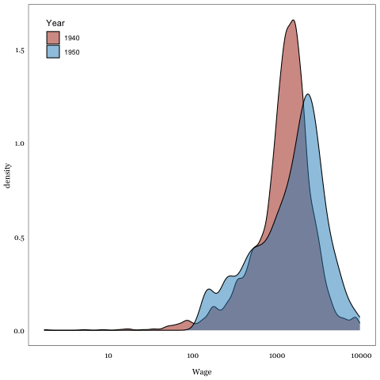

* Data Visualizations
:PROPERTIES:
:HEADER-ARGS:R: :tangle R/figures.R :session *R:internment*
:END:

#+begin_src R :results silent
library(tidyverse)
library(paletteer)
library(haven)
#+end_src

#+begin_src R
theme_internment <- function(){ 
    font <- "Georgia"   #assign font family up front
    
    theme_bw() %+replace%    #replace elements we want to change
    
    theme(
      
      #grid elements
      panel.grid.major = element_blank(),    #strip major gridlines
      panel.grid.minor = element_blank(),    #strip minor gridlines
      axis.ticks = element_blank(),          #strip axis ticks
      
      #text elements
      plot.title = element_text(             #title
                   family = font,            #set font family
                   size = 20,                #set font size
                   face = 'bold',            #bold typeface
                   hjust = 0,                #left align
                   vjust = 2),               #raise slightly
      
      plot.subtitle = element_text(          #subtitle
                   family = font,            #font family
                   size = 14),               #font size
      
      plot.caption = element_text(           #caption
                   family = font,            #font family
                   size = 9,                 #font size
                   hjust = 1),               #right align
      
      axis.title = element_text(             #axis titles
                   family = font,            #font family
                   size = 10),               #font size
      
      axis.text = element_text(              #axis text
                   family = font,            #axis famuly
                   size = 9),                #font size
      
      axis.text.x = element_text(            #margin for axis text
                    margin=margin(5, b = 10))
      
    )
}
#+end_src

#+RESULTS:

** MLP Linking
#+begin_src R :exports results :results graphics file :file figures/mlp-wage-test.png
read_csv("data/mlp_sample.csv") |>
  filter(!is.na(INCWAGE)) |>
  mutate(Year = as_factor(YEAR), Wage = INCWAGE) |>
  ggplot(aes(x=Wage, group=Year, fill=Year)) +
  scale_x_log10() +
  geom_density(alpha=0.5) +
  theme_internment() +
  theme(legend.position = "inside",
        legend.position.inside = c(0.1,0.9)) +
  scale_fill_paletteer_d("MetBrewer::Juarez")
#+end_src

#+RESULTS:

** Internment Probability 
*** TODO Plot with pr_intern distribution among individual sample
#+begin_src R :exports results :results graphics file :file figures/pr_intern_plot.png
read_csv("data/linked_sample.csv") |>
  select(RACE, p_ij) |>
  mutate(Race = case_when(as_factor(RACE) == "4" ~ "Chinese",
                          as_factor(RACE) == "5" ~ "Japanese")
         ) |>
  ggplot() +
  geom_histogram(aes(x=p_ij, fill=Race, group=Race), position = "dodge", binwidth = 0.1) +
  geom_vline(xintercept = 0.5) +
  xlim(-0.1,2) +
  theme_internment() +
  theme(legend.position = "inside",
        legend.position.inside = c(0.9,0.9)) +
  xlab("Internment Probability") +
  scale_fill_paletteer_d("MetBrewer::Juarez")
#+end_src

#+RESULTS:
[[file:figures/pr_intern_plot.png]]

*** Internee County of Origin vs 1940 Japanese Population
#+begin_src R :colnames yes
read_csv(file = "data/pr_intern_status.csv") |>
  group_by(state, county) |>
  summarise(
    n_interned = sum(n_z_I, na.rm = T),
    n_1940 = sum(n_z, na.rm = T),
    prop_interned = round(n_interned / n_1940, 2)
  ) |>
  arrange(desc(n_interned))
#+end_src

#+RESULTS:
| state            | county                   | n_interned | n_1940 | prop_interned |
|------------------+--------------------------+------------+--------+---------------|
| California       | Los Angeles              |      33520 |    132 |        253.94 |
| Washington       | King                     |       8598 |      5 |        1719.6 |
| California       | Sacramento               |       7827 |      1 |          7827 |
| California       | Fresno                   |       5620 |      0 |           Inf |
| California       | San Joaquin              |       4912 |      2 |          2456 |
| California       | San Francisco            |       4792 |      2 |          2396 |
| California       | Alameda                  |       4694 |      2 |          2347 |
| California       | Santa Clara              |       3669 |      0 |           Inf |
| Oregon           | Multnomah                |       2242 |      0 |           Inf |
| California       | Tulare                   |       2202 |      0 |           Inf |
| California       | San Diego                |       1997 |      0 |           Inf |
| Washington       | Pierce                   |       1946 |      0 |           Inf |
| California       | Santa Barbara            |       1938 |      0 |           Inf |
| California       | Orange                   |       1855 |      0 |           Inf |
| California       | Monterey                 |       1822 |      0 |           Inf |
| California       | Placer                   |       1767 |      0 |           Inf |
| California       | Imperial                 |       1530 |      0 |           Inf |
| California       | Santa Cruz               |       1398 |      1 |          1398 |
| California       | Kern                     |       1241 |      0 |           Inf |
| California       | Yolo                     |       1106 |      0 |           Inf |
| California       | San Mateo                |        962 |      0 |           Inf |
| Washington       | Yakima                   |        847 |      0 |           Inf |
| California       | Contra Costa             |        765 |      0 |           Inf |
| California       | Sonoma                   |        730 |      0 |           Inf |
| California       | Solano                   |        724 |      0 |           Inf |
| California       | Stanislaus               |        698 |      0 |           Inf |
| California       | Ventura                  |        661 |      0 |           Inf |
| Hawaii           | Honolulu                 |        620 |      0 |           Inf |
| California       | Riverside                |        548 |      0 |           Inf |
| California       | Yuba                     |        527 |      0 |           Inf |
| California       | Kings                    |        485 |      0 |           Inf |
| California       | Merced                   |        458 |      0 |           Inf |
| California       | San Benito               |        445 |      0 |           Inf |
| California       | San Luis Obispo          |        439 |      0 |           Inf |
| Oregon           | Hood River               |        416 |      0 |           Inf |
| California       | San Bernardino           |        394 |      0 |           Inf |
| California       | Sutter                   |        361 |      0 |           Inf |
| Washington       | Kitsap                   |        275 |      0 |           Inf |
| Hawaii           | Hawaii                   |        240 |      0 |           Inf |
| California       | Butte                    |        228 |      0 |           Inf |
| Arizona          | Maricopa                 |        221 |      0 |           Inf |
| California       | Madera                   |        180 |      0 |           Inf |
| California       | Colusa                   |        177 |      0 |           Inf |
| Oregon           | Marion                   |        176 |      0 |           Inf |
| Oregon           | Clackamas                |        163 |      0 |           Inf |
| Oregon           | Washington               |        149 |      0 |           Inf |
| Washington       | Clark                    |        129 |      0 |           Inf |
| Washington       | Cowlitz                  |        126 |      0 |           Inf |
| Alaska           | First Judicial Division  |         96 |      0 |           Inf |
| Hawaii           | Kauai                    |         94 |      0 |           Inf |
| Hawaii           | Maui                     |         92 |      0 |           Inf |
| Washington       | Thurston                 |         84 |      0 |           Inf |
| California       | Marin                    |         80 |      0 |           Inf |
| Washington       | Klikitat                 |         76 |      0 |           Inf |
| Oregon           | Wasco                    |         64 |      0 |           Inf |
| Oregon           | Clatsop                  |         60 |      0 |           Inf |
| Washington       | Skagit                   |         60 |      0 |           Inf |
| Washington       | Pacific                  |         59 |      0 |           Inf |
| Washington       | Lewis                    |         54 |      0 |           Inf |
| Oregon           | Polk                     |         48 |      0 |           Inf |
| California       | Mendocino                |         47 |      0 |           Inf |
| California       | Tehama                   |         42 |      0 |           Inf |
| Oregon           | Jackson                  |         42 |      0 |           Inf |
| California       | Napa                     |         38 |      0 |           Inf |
| Washington       | Snohomish                |         38 |      0 |           Inf |
| Alaska           | Third Judicial Division  |         35 |      0 |           Inf |
| Washington       | Whatcom                  |         34 |      0 |           Inf |
| Oregon           | Columbia                 |         33 |      0 |           Inf |
| Washington       | Benton                   |         32 |      0 |           Inf |
| Washington       | Chelan                   |         27 |      0 |           Inf |
| Washington       | Jefferson                |         24 |      0 |           Inf |
| Oregon           | Jefferson                |         23 |      0 |           Inf |
| New Mexico       | Curry                    |         20 |      0 |           Inf |
| Washington       | Mason                    |         19 |      0 |           Inf |
| Washington       | Clallam                  |         13 |      0 |           Inf |
| Utah             | Box Elder                |         12 |      0 |           Inf |
| Washington       | Grays Harbor             |         11 |      0 |           Inf |
| New York         |                          |         10 |      0 |           Inf |
| Arizona          | Yuma                     |          8 |      0 |           Inf |
| California       | Mono/Alpine              |          8 |      0 |           Inf |
| Arizona          | Pinal                    |          7 |      0 |           Inf |
| California       |                          |          7 |      0 |           Inf |
| Hawaii           |                          |          7 |      0 |           Inf |
| Oregon           | Deschutes                |          7 |      0 |           Inf |
| Alaska           | Fourth Judicial Division |          6 |      0 |           Inf |
| Arizona          | Gila                     |          6 |      0 |           Inf |
| California       | El Dorado                |          6 |      0 |           Inf |
| California       | Nevada                   |          6 |      0 |           Inf |
| California       | Shasta                   |          6 |      0 |           Inf |
| Arizona          | Cochise                  |          5 |      0 |           Inf |
| New Mexico       | Santa Fe                 |          5 |      0 |           Inf |
| Oregon           | Yamhill                  |          5 |      0 |           Inf |
| Utah             | Wasatch                  |          5 |      0 |           Inf |
| California       | Modoc                    |          4 |      0 |           Inf |
| Colorado         | Otero                    |          4 |      0 |           Inf |
| Illinois         | Cook                     |          4 |      0 |           Inf |
| Missouri         | St Louis                 |          4 |      0 |           Inf |
| Washington       | San Juan                 |          4 |      0 |           Inf |
| Alaska           | Second Judicial Division |          3 |      0 |           Inf |
| Idaho            | Bingham                  |          3 |      0 |           Inf |
| Nevada           | Lyon                     |          3 |      0 |           Inf |
| New York         | Chemung                  |          3 |      0 |           Inf |
| Oregon           | Lane                     |          3 |      0 |           Inf |
| Texas            | Harris                   |          3 |      0 |           Inf |
| Washington       | Wahkiakum                |          3 |      0 |           Inf |
| Washington       | Whitman                  |          3 |      0 |           Inf |
| Colorado         | Weld                     |          2 |      0 |           Inf |
| Florida          | Pinellas                 |          2 |      0 |           Inf |
| North Dakota     | Burleigh                 |          2 |      0 |           Inf |
| Oregon           | Benton                   |          2 |      0 |           Inf |
| Oregon           | Lincoln                  |          2 |      0 |           Inf |
| Oregon           | Linn                     |          2 |      0 |           Inf |
| Pennsylvania     | York                     |          2 |      0 |           Inf |
| Virginia         | Norfolk                  |          2 |      0 |           Inf |
| Washington       | Franklin                 |          2 |      0 |           Inf |
| Washington       | Island                   |          2 |      0 |           Inf |
| Washington       |                          |          2 |      0 |           Inf |
| Wisconsin        | Grant                    |          2 |      0 |           Inf |
| Alabama          | Jefferson                |          1 |      0 |           Inf |
| Arizona          | Yavapai                  |          1 |      0 |           Inf |
| Arkansas         | Pulaski                  |          1 |      0 |           Inf |
| British Columbia | Vancouver                |          1 |      0 |           Inf |
| California       | Lake                     |          1 |      0 |           Inf |
| California       | Plumas                   |          1 |      0 |           Inf |
| Idaho            | Bannock                  |          1 |      0 |           Inf |
| Idaho            | Bonneville               |          1 |      0 |           Inf |
| Michigan         | Calhoun                  |          1 |      0 |           Inf |
| Missouri         | Henry/Rives              |          1 |      0 |           Inf |
| Montana          | Lewis and Clark          |          1 |      0 |           Inf |
| Montana          | Missoula                 |          1 |      0 |           Inf |
| Montana          | Park                     |          1 |      0 |           Inf |
| Nebraska         | Douglas                  |          1 |      0 |           Inf |
| Nevada           | Douglas                  |          1 |      0 |           Inf |
| New York         | Dutchess                 |          1 |      0 |           Inf |
| Oregon           | Tillamook                |          1 |      0 |           Inf |
| Pennsylvania     | Lackawanna               |          1 |      0 |           Inf |
| Pennsylvania     | Philadelphia             |          1 |      0 |           Inf |
| Utah             | Carbon                   |          1 |      0 |           Inf |
| Virginia         | Suffolk City             |          1 |      0 |           Inf |
| Washington       | Asotin                   |          1 |      0 |           Inf |
| Washington       | Spokane                  |          1 |      0 |           Inf |

** Age Distribution
#+begin_src R
library(ipumsr)
library(tidyverse)
library(dbplyr)
library(duckdb)
# data extract file
db <- dbConnect(duckdb(), dbdir = "data/ipums_db.duckdb")
tbl = "ipums_microdata"

pr_I <- read_csv("data/pr_intern_status.csv")

ja_pop <- tbl(db, tbl) |>
  select(YEAR, STATEFIP, COUNTYICP, SEX, BIRTHYR, MARST, BPL, BPLD, NATIVITY, CITIZEN,
         EDUC EMPSTAT, LABFORCE, OCC1950, INCTOT, INCWAGE, BPL_MOM, BPL_POP) |>
  collect() |>
  mutate(
    # replace missing values with NAs and adjust all dollar amounts to 1940 levels
    across(c(INCWAGE),
           ~ case_when(.x %in% c(999999,999998) ~ NA,
                             YEAR == 1950 ~ .x * 0.59, # deflated dollars to 1940 standards
                             .default = .x)
           ),
    ) |>
  left_join(pr_I, by = c("STATEFIP", "COUNTYICP", SEX="sex", BIRTHYR="birthyr", BPL="birthplace")) |>
  mutate(internee = ifelse(pr_intern > 0.5, T, F))

dbDisconnect()

data_int <- read_csv("data/all_internees.csv")
#+end_src

#+RESULTS:

#+begin_src R :exports results :results graphics file :file figures/internee-age_plot.pdf
d1 <- data_int |>
  mutate(group = "Internees") |>
  select(group, NHGISST, NHGISCTY, SEX=sex, BIRTHYR=birthyr,
         BPL=bpl, NATIVITY=nativity)

d2 <- ja_pop |>
  filter(YEAR == 1940, RACE == 5) |>
  mutate(
    group = "All Japanese",
    SEX = ifelse(SEX==1, "male", "female"),
    NHGISST = str_pad(string = STATEFIP*10, width = 3, side = "left", pad = "0"),
    NHGISCTY = str_pad(COUNTYICP, width = 4, side = "left", pad = "0") ) |>
  select(group, NHGISST, NHGISCTY, SEX, BIRTHYR, BPL, NATIVITY)

plot_d <- bind_rows(d1,d2)

ggplot(data = plot_d, aes(x=BIRTHYR, group = group, fill = group)) +
  geom_density(alpha = 0.5) +
  theme_minimal() +
  theme(
    ## legend.title = element_blank(),
    legend.position = "bottom"
  ) +
  labs(
    title = "Internee Birth Year Distribution vs Overall Japanese Population",
    x = "Birth Year",
    )

#+end_src

#+RESULTS:
[[file:figures/internee-age_plot.pdf]]

** Wages
#+begin_src R :exports results :results graphics file :file figures/internee-wage_plot.pdf

ggplot(data = data, aes(x=INCWAGE, group = internee, fill = internee)) +
  geom_density(alpha = 0.5) +
  facet_wrap("YEAR") +
  scale_x_log10() +
  theme_minimal() +
  theme(
    ## legend.title = element_blank(),
    legend.position = "bottom"
  ) +
  labs(
    title = "Internee Wage Distribution vs Overall Japanese Population",
    x = "Real Wages (1940 $)",
    )
#+end_src

#+RESULTS:
[[file:figures/internee-wage_plot.pdf]]
