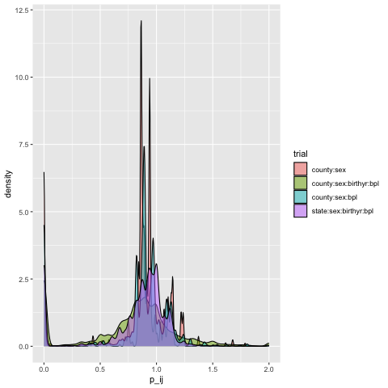

* Predicted Internment Status
#+begin_src R :results silent
library(tidyverse)
#+end_src

The WRA records give a complete list of all individuals who were interned during World War II.
However, if we as researchers of the impact of internment want to know more about the migration choices or economic outcomes faced by these individuals we need to match these individuals with data from other sources (in my case the full-count census).

To determine the probability that someone who shows up in the census is the same as one of the internees, I borrow Jaime Arellano-Bover's method of estimating predicted internment status using Bayes Rule.
The probability that an individual $i$ in the demographic group $z$ who lived in county $c$ in 1942 was interned ($Pr(I_{i}=1|z_i,c_{i})$
could be determined from the proportion of the whole population who were interned ($Pr(I_{i}=1)},
the proportion of the population with demographics $z$ who lived in county $c$ in 1942 ($Pr(z_i,c_{i}^{1942}$),
and the probability of a known internee having the same demographics and county in 1942 ($Pr(z_i,c_i^{42}|I_i=1)$).

$$Pr(I_i=1|z_i,c_i^{42}) = \frac{Pr(z_i,c_i^{42}|I_i=1) \cdot Pr(I_i=1)}{Pr(z_i,c_i^{42})}$$

However, because my target sample of census respondents were only asked about their county of residence in the year of the census and not in 1942, $c_i^{1940}$ is used as a proxy for census respondents' 1942 locations.

The estimator for the true internment status of a census respondent is:

$$
\begin{equation}
\hat{E}[I]_{zc} =
\frac{n(i | z_i=z, ~ c_{i}^{42}=c)}{n(j | z_j=z, ~ c_{j}^{40}=c)}}
\end{equation}
$$

This will produce a biased estimate of true internment status if there were unobserved changes in population in each county between 1940 and 1942. For example, for a county that experienced a net outflow of residents, then the ratio of residents in 1940 vs 1942 would be greater than 1 and we would have an estimated internment probability that overstates the likelihood of anyone who lived in that county in 1940 would be interned.

One source of differences between the number of 1940 residents and the number of internees who came from each county is that the Army initially allowed Japanese persons to choose to move out of the exclusion areas before they gathered the remaining people into assembly centers.

- $Pr(z_i,c_i^{40}|I_i=1)$ : proportion of internees with in each demographic group

- $Pr(I_i=1)$ : Fraction of internees out of entire 1940 Japanese population

- $Pr(z_i,c_i^{40})$: proportion of Japanese Americans in each demographic group in 1940 census
** Predicted Interment Status Estimator
:PROPERTIES:
:HEADER-ARGS:R: :session *R:internment*
:END:
My version of the estimator outlined is a function which takes in internee data and 1940 census data to calculate predicted internment probability.
I allow for using different demographic variables to create groups to test different specifications.

#+begin_src R :tangle R/predict_internment.R
predict_internment <- function(census_1940, internees="data/all_internees.dta", vars=c("STATEFIP", "COUNTYICP")) {
  library(tidyverse)
  library(dbplyr)
 
  # Ensure internee_data is a tibble; read if character
  if (is.character(internees)) {
    internees <- haven::read_dta(internees)
  }
  # Cleanup internee data
  data_int <- internees |>
    rename_with(toupper) |>
    mutate(STATEFIP = as.integer(NHGISST)/10,
           COUNTYICP = as.integer(NHGISCTY),
           across(RACE:FATH_OCC_ABROAD, as.numeric),
           cohort = case_when(
           BIRTHYR %in% 1940:1942 ~ "c40_42",
           BIRTHYR %in% 1929:1939 ~ "c29_39",
           BIRTHYR %in% 1924:1928 ~ "c24_28",
           BIRTHYR %in% 1913:1923 ~ "c13_23",
           BIRTHYR %in% 1903:1912 ~ "c03_12",
           BIRTHYR %in% 1893:1902 ~ "c93_02",
           BIRTHYR %in% 1883:1892 ~ "c83_92",
           BIRTHYR < 1883 ~ "c42_83",
         ) ) |>
    filter(!is.na(STATE),!is.na(COUNTY),RACE==5) 
    # AK, HI don't have census data, so drop them here
    ## filter(!STATE %in% c("Alaska", "Hawaii"))

  # Count by group in internee data
  int_grp <- data_int |>
    group_by(across(all_of(vars))) |>
    summarise(n_i = n(), .groups = "drop")

  # add cohort variable to census
   census_1940 <- census_1940 |>
    mutate(cohort = case_when(
           BIRTHYR %in% 1940:1942 ~ "c40_42",
           BIRTHYR %in% 1929:1939 ~ "c29_39",
           BIRTHYR %in% 1924:1928 ~ "c24_28",
           BIRTHYR %in% 1913:1923 ~ "c13_23",
           BIRTHYR %in% 1903:1912 ~ "c03_12",
           BIRTHYR %in% 1893:1902 ~ "c93_02",
           BIRTHYR %in% 1883:1892 ~ "c83_92",
           BIRTHYR < 1883 ~ "c42_83",
         ) )

  # Check required columns
  missing_census <- setdiff(vars, colnames(census_1940))
  if (length(missing_census) > 0) {
    stop("Census data is missing required columns: ",
         paste(missing_census, collapse = ", "))
  }

  # Join and calculate fraction
  # Count by group in census
  pop_grp <- census_1940 |>
    group_by(across(all_of(vars))) |>
    summarise(n_j=n(), .groups = "drop")

  combined <- pop_grp |>
    full_join(int_grp, by = vars) |>
    mutate(
      n_i = replace_na(n_i, 0),
      p_ij = n_i / n_j
    )

  # Attach back to census data
  census_augmented <- census_1940 |>
    left_join(combined, by = vars)

  return(census_augmented)
}
#+end_src

#+RESULTS:

** Trying to find the best combination of grouping variables:
:PROPERTIES:
:HEADER-ARGS:R: :session *R:internment*
:END:

#+begin_src R 
library(tidyverse)
library(dbplyr)
library(duckdb)
# data extract file
db <- dbConnect(duckdb(), dbdir = "data/ipums_db.duckdb")
tbl = "ipums_microdata"

census_dat <- tbl(db,tbl) |>
  filter(RACE==5, YEAR==1940) |>
  select("STATEFIP", "COUNTYICP", "RACE", "SEX", "BIRTHYR", "BPL",
         "BPL_MOM", "BPL_POP", "NATIVITY") |>
  collect()
dbDisconnect(db)

probs_state <- census_dat |>
  predict_internment(vars=c("STATEFIP")) |>
  mutate(type="state") |>
  select(type, p_ij)
probs_county <- census_dat |>
  predict_internment(vars=c("STATEFIP","COUNTYICP")) |>
  mutate(type="county") |>
  select(type, p_ij)
probs_arellanobover <- census_dat |>
  predict_internment(vars=c("STATEFIP","BPL","cohort","SEX")) |>
  filter(SEX==1) |>
  mutate(type="arellano-bover") |>
  select(type, p_ij)
probs_full <- census_dat |>
  predict_internment(vars=c("STATEFIP","COUNTYICP","SEX","cohort","BPL")) |>
  mutate(type="full") |>
  select(type, p_ij)

probs_types <- bind_rows(probs_state,probs_county,probs_arellanobover,probs_full)
#+end_src

#+RESULTS:

#+begin_src R :results graphics file :file figures/test-p_ij.png
ggplot(probs_types, aes(x=p_ij, group=type, fill=type)) +
  geom_density(alpha=0.5) +
  scale_y_sqrt() +
  xlim(0,2)
#+end_src

#+RESULTS:

** TODO Incorporate Voluntary Migration Rates
The Final Report from DeWitt records the number of Japanese Americans who chose to voluntarily relocate away from the West Coast prior to the orders to relocate to Assembly Centers.

#+begin_src R :colnames yes
library(tidyverse)
read_csv("data/WDC-voluntary-migration.csv") |>
  arrange(desc(Total))
#+end_src

#+RESULTS:
| state      | county          | Total | Male | Female |
|------------+-----------------+-------+------+--------|
| California | Los Angeles     |  1969 | 1080 |    889 |
| California | Santa Clara     |   443 |  231 |    212 |
| Washington | King            |   403 |  183 |    220 |
| California | Alameda         |   263 |  142 |    121 |
| California | Monterey        |   234 |  143 |     91 |
| California | San Francisco   |   207 |   95 |    112 |
| California | Santa Barbara   |   205 |  116 |     89 |
| California | Fresno          |   153 |   75 |     78 |
| California | San Mateo       |   139 |   67 |     72 |
| California | Orange          |    88 |   54 |     34 |
| California | Imperial        |    82 |   35 |     47 |
| California | Santa Cruz      |    82 |   44 |     38 |
| California | Tulare          |    64 |   44 |     20 |
| California | San Diego       |    61 |   31 |     30 |
| Arizona    | Maricopa        |    58 |   34 |     24 |
| Washington | Pierce          |    56 |   26 |     30 |
| Oregon     | Multnomah       |    54 |   24 |     30 |
| Oregon     | Washington      |    50 |   32 |     18 |
| California | Ventura         |    29 |   14 |     15 |
| California | Sacramento      |    24 |   10 |     14 |
| California | San Joaquin     |    21 |   10 |     11 |
| California | Tuolumne        |    20 |   15 |      5 |
| California | Contra Costa    |    18 |    8 |     10 |
| California | Sonoma          |    17 |    9 |      8 |
| California | San Bernardino  |    13 |    9 |      4 |
| Oregon     | Hood River      |    13 |    9 |      4 |
| California | San Luis Obispo |    11 |    5 |      6 |
| California | Riverside       |    10 |    4 |      6 |
| California | Marin           |     8 |    4 |      4 |
| California | Stanislaus      |     8 |    4 |      4 |
| California | Butte           |     7 |    5 |      2 |
| California | Kern            |     7 |    5 |      2 |
| Washington | Yakima          |     7 |    4 |      3 |
| California | Merced          |     6 |    2 |      4 |
| California | San Benito      |     6 |    4 |      2 |
| Washington | Kitsap          |     6 |    4 |      2 |
| Washington | Lewis           |     6 |    1 |      5 |
| Washington | Thurston        |     6 |    2 |      4 |
| Oregon     | Polk            |     5 |    2 |      3 |
| Washington | Clark           |     5 |    3 |      2 |
| Washington | Pacific         |     5 |    2 |      3 |
| Oregon     | Lane            |     4 |    2 |      2 |
| California | Kings           |     3 |    1 |      2 |
| Washington | Okanogan        |     3 |    3 |        |
| California | Placer          |     2 |    1 |      1 |
| California | Yolo            |     2 |    2 |        |
| Oregon     | Yamhill         |     2 |      |      2 |
| Washington | Chelan          |     2 |    1 |      1 |
| California | Yuba            |     1 |      |      1 |
| Oregon     | Clatsop         |     1 |    1 |        |
